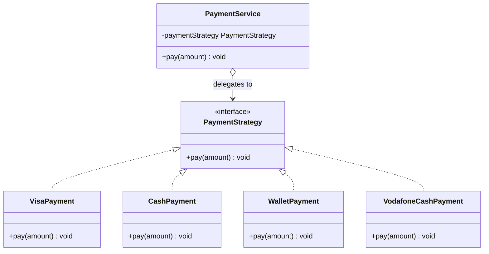

# 🎯 Strategy Pattern

**Category:** Behavioral

> Defines a family of algorithms, encapsulates each one, and makes them
> interchangeable. Strategy lets the algorithm vary independently from
> clients that use it.

## The Problem

Imagine a checkout screen that has to accept Visa, cash, a mobile wallet, and
Vodafone Cash — and next quarter, PayPal too. The "obvious" first attempt is
a single `pay()` method with a giant conditional:

```dart
void pay(String method, double amount) {
  if (method == 'visa') {
    // charge the card, call the bank gateway...
  } else if (method == 'cash') {
    // count the change...
  } else if (method == 'wallet') {
    // hit the wallet API...
  } else if (method == 'vodafone_cash') {
    // hit the Vodafone Cash API...
  }
  // every new payment method means editing this method again
}
```

This is the classic **code smell**: one method that knows about every
variant, grows forever, and has to be re-tested in full every time a new
payment method is added — even though the old branches didn't change. It
violates the **Open/Closed Principle**: the class is never "closed" for
modification.

**Real-world analogy:** think of a traveler choosing how to get to the
airport — taxi, bus, or bike. The traveler ("context") doesn't change who
they are based on the transport; they just say "take me to the airport" and
plug in whichever "strategy" (mode of transport) fits today. The goal
("get to the airport") stays the same; only the algorithm for achieving it
changes.

## How It Works

1. Define a **Strategy interface** with one method that all algorithms share
   (here, `pay(amount)`).
2. Implement each algorithm as its own **ConcreteStrategy** class.
3. Give the **Context** (the object that needs the behavior) a reference to
   a `Strategy`, injected from the outside instead of hard-coded.
4. The Context delegates the work to whichever strategy it currently holds —
   it never checks "which one am I" with an `if`.
5. Callers can swap the strategy at runtime, and adding a new strategy never
   requires touching the Context or any existing strategy.

Mapped to this example: `PaymentService` is the Context. It doesn't know or
care whether it's holding a `VisaPayment` or a `CashPayment` — it just calls
`pay()` on whatever `PaymentStrategy` it was handed.

## Class Diagram



## Practical Examples

### Example 1: Simple illustrative example

A minimal Strategy setup with two sorting strategies, to see the shape of
the pattern with nothing else in the way.

```dart
// The Strategy interface — every algorithm implements this one method.
abstract class SortStrategy {
  void sort(List<int> data);
}

// Concrete strategy: ascending order.
class AscendingSort implements SortStrategy {
  @override
  void sort(List<int> data) => data.sort((a, b) => a.compareTo(b));
}

// Concrete strategy: descending order.
class DescendingSort implements SortStrategy {
  @override
  void sort(List<int> data) => data.sort((a, b) => b.compareTo(a));
}

// The Context: holds a strategy and delegates to it, never branching itself.
class Sorter {
  Sorter(this._strategy);
  SortStrategy _strategy;

  void setStrategy(SortStrategy strategy) => _strategy = strategy;

  void sortData(List<int> data) => _strategy.sort(data);
}

void main() {
  final numbers = [5, 3, 8, 1, 9];
  final sorter = Sorter(AscendingSort());

  sorter.sortData(numbers);
  print('Ascending: $numbers'); // [1, 3, 5, 8, 9]

  sorter.setStrategy(DescendingSort());
  sorter.sortData(numbers);
  print('Descending: $numbers'); // [9, 8, 5, 3, 1]
}
```

### Example 2: Realistic, production-like example

A shipping-cost calculator that must support several carriers, each with its
own pricing rule, selected at checkout time.

```dart
// Strategy interface: every carrier can quote a price for a package.
abstract class ShippingStrategy {
  double calculate({required double weightKg, required double distanceKm});
}

// Flat-rate courier: fixed cost per shipment.
class FlatRateShipping implements ShippingStrategy {
  static const double _flatFee = 5.0;

  @override
  double calculate({required double weightKg, required double distanceKm}) =>
      _flatFee;
}

// Weight-based carrier: price scales with package weight.
class WeightBasedShipping implements ShippingStrategy {
  static const double _pricePerKg = 2.5;

  @override
  double calculate({required double weightKg, required double distanceKm}) =>
      weightKg * _pricePerKg;
}

// Distance-based courier: price scales with delivery distance.
class DistanceBasedShipping implements ShippingStrategy {
  static const double _pricePerKm = 0.15;

  @override
  double calculate({required double weightKg, required double distanceKm}) =>
      distanceKm * _pricePerKm;
}

// Context: the checkout flow. It knows nothing about how each carrier prices
// a shipment — it only calls `calculate` on the strategy it was configured with.
class CheckoutSession {
  CheckoutSession(this._shippingStrategy);
  ShippingStrategy _shippingStrategy;

  void selectShippingMethod(ShippingStrategy strategy) {
    _shippingStrategy = strategy;
  }

  double getShippingCost({required double weightKg, required double distanceKm}) {
    return _shippingStrategy.calculate(weightKg: weightKg, distanceKm: distanceKm);
  }
}

void main() {
  final checkout = CheckoutSession(FlatRateShipping());
  print('Flat rate: \$${checkout.getShippingCost(weightKg: 3, distanceKm: 40)}');

  checkout.selectShippingMethod(WeightBasedShipping());
  print('Weight-based: \$${checkout.getShippingCost(weightKg: 3, distanceKm: 40)}');

  checkout.selectShippingMethod(DistanceBasedShipping());
  print('Distance-based: \$${checkout.getShippingCost(weightKg: 3, distanceKm: 40)}');
}
```

## How It's Structured Here

- [classes/payment_strategy.dart](classes/payment_strategy.dart) — the
  `PaymentStrategy` interface: the one method (`pay`) every strategy must implement.
- [classes/visa_payment.dart](classes/visa_payment.dart),
  [cash_payment.dart](classes/cash_payment.dart),
  [wallet_payment.dart](classes/wallet_payment.dart),
  [vodafone_cash_payment.dart](classes/vodafone_cash_payment.dart) — concrete
  strategies, each implementing `pay` differently.
- [services/payment_service.dart](services/payment_service.dart) — the
  context. It holds a `PaymentStrategy` and delegates `pay()` to it; it has no
  idea which concrete strategy it's holding.
- [main.dart](main.dart) — swaps the strategy passed into `PaymentService` at
  runtime (Visa, then Cash, then Wallet, then Vodafone Cash) without changing
  `PaymentService` itself.

## When to Use

- You have several ways to do the same job (pay, sort, compress, validate)
  and pick between them based on runtime conditions (user choice, config, type) — because
  the choice belongs at the edge, not scattered through the algorithm's logic.
- You're tempted to write a big `if/else` or `switch` on a "kind" that gets
  duplicated in multiple places — Strategy collapses that into one branch, at
  the one place the strategy is chosen.
- You want to add a new variant later without touching existing, tested code
  (Open/Closed Principle) — because each strategy is a self-contained,
  independently testable class.
- Several related classes only differ in behavior — Strategy lets you
  parameterize one class with different behaviors instead of duplicating it.

## When NOT to Use

- You only have one algorithm, or the algorithm never changes — the
  interface and extra classes are pure overhead with no payoff.
- The variants are trivial (a single `if` with two cheap branches) — a plain
  conditional is more readable than a family of one-method classes.
- The Context needs to reach deep into strategy-specific state — if every
  strategy needs different data passed in, the shared interface starts to
  leak and the abstraction stops paying for itself.
- Clients would need to know internal details of each strategy to pick the
  right one — that just moves the `if/else` you removed into the caller
  instead of eliminating it.

## Related Patterns

| Pattern | Relationship |
|---|---|
| [State](../) | Structurally identical to Strategy, but State's transitions are driven by the object itself, not chosen by the client. |
| [Decorator](../3-decorator/README.md) | Complements Strategy — Decorator changes an object's "skin" (added responsibilities), Strategy changes its "guts" (the algorithm used). |
| [Factory Method](../4-factory-method/README.md) | Often used together — a factory can decide *which* strategy to instantiate based on context. |
| Template Method | Alternative — Template Method varies behavior through inheritance and overriding steps; Strategy varies it through composition and delegation. |

## Key Takeaway

Strategy turns a family of related algorithms into interchangeable, composable
objects, so the code that *uses* an algorithm never has to know which one it's
using. This is the **"favor composition over inheritance"** principle in
action: instead of subclassing `PaymentService` for every payment type, you
compose it with the behavior it needs at runtime.
