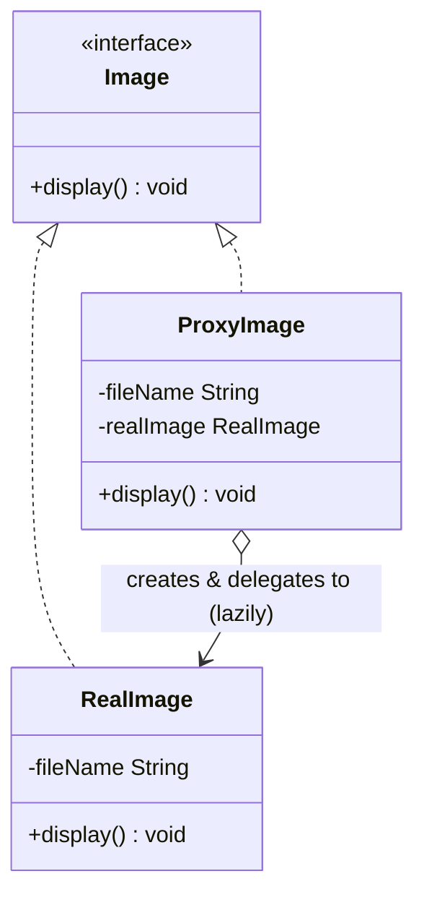

# 🖼️ Proxy Pattern

**Category:** Structural

> Provides a surrogate or placeholder for another object to control access
> to it.

## The Problem

Loading a high-resolution image from disk is expensive, but a gallery might
create hundreds of `Image` objects up front — most of which the user will
never actually scroll to see. Loading them all eagerly wastes time and
memory on images nobody looks at:

```dart
class RealImage {
  RealImage(this.fileName) {
    _loadFromDisk(); // expensive — happens the instant the object exists
  }
  final String fileName;
  void _loadFromDisk() => print('Loading $fileName from disk...');
  void display() => print('Displaying $fileName');
}

void main() {
  final gallery = [
    RealImage('photo1.jpg'), // loaded immediately
    RealImage('photo2.jpg'), // loaded immediately
    RealImage('photo3.jpg'), // loaded immediately, even if never displayed
  ];
  // the cost of loading every image was paid up front, unconditionally
}
```

Every `RealImage` pays its full loading cost the moment it's constructed,
whether or not `display()` is ever called on it. There's no way to say
"create the placeholder now, but only do the expensive work when it's
actually needed" without changing how callers use `RealImage`.

**Real-world analogy:** a credit card. It's a stand-in for your bank account
— when you hand it to a cashier, you're not handing over your actual money,
you're handing over something that *represents* access to it, and the card
network controls and checks that access before any real funds move. The
merchant interacts with the card exactly like they would with cash, without
needing direct access to your bank account itself.

## How It Works

1. Define a **Subject interface** that both the real object and its
   stand-in will implement (here, `Image`).
2. Implement the **RealSubject** — the actual, possibly expensive or
   sensitive object (`RealImage`).
3. Implement a **Proxy** that also satisfies the Subject interface, but
   holds a reference to the RealSubject and controls access to it — creating
   it lazily, checking permissions, adding caching, logging, or forwarding
   to a remote service, depending on the kind of proxy.
4. Client code depends only on the Subject interface, so a `RealImage` and a
   `ProxyImage` are completely interchangeable from the caller's point of
   view.
5. The proxy does its extra work (loading, checking, logging) either before
   or instead of delegating to the real subject.

Mapped to this example: `ProxyImage` implements `Image` and holds a
nullable `RealImage?`. It only constructs the real image the first time
`display()` is called — later calls reuse the already-loaded instance — so
the caller in `main.dart` never knows (or needs to know) whether it's
holding a real or a proxied image.

## Class Diagram



## Practical Examples

### Example 1: Simple illustrative example

A protection proxy that checks permissions before letting a request reach a
sensitive document — to see the shape of the pattern with nothing else in
the way.

```dart
// Subject interface: both the real document and its proxy implement this.
abstract class Document {
  void view();
}

// RealSubject: the actual sensitive resource.
class ConfidentialDocument implements Document {
  ConfidentialDocument(this.title);
  final String title;

  @override
  void view() => print('Viewing confidential document: $title');
}

// Proxy: checks access before delegating to the real subject.
class ProtectedDocumentProxy implements Document {
  ProtectedDocumentProxy(this._document, this._userRole);
  final ConfidentialDocument _document;
  final String _userRole;

  @override
  void view() {
    if (_userRole != 'admin') {
      print('Access denied: only admins can view "${_document.title}"');
      return;
    }
    _document.view();
  }
}

void main() {
  final document = ConfidentialDocument('Q3 Financial Report');

  final adminAccess = ProtectedDocumentProxy(document, 'admin');
  final guestAccess = ProtectedDocumentProxy(document, 'guest');

  adminAccess.view(); // allowed
  guestAccess.view(); // denied
}
```

### Example 2: Realistic, production-like example

A caching proxy in front of a slow, remote-feeling weather API — a common
real-world use of Proxy to avoid repeated expensive calls for data that
doesn't change often.

```dart
// Subject interface: anything that can fetch a city's weather.
abstract class WeatherService {
  Future<String> getWeather(String city);
}

// RealSubject: simulates a slow network call to a remote weather API.
class RemoteWeatherService implements WeatherService {
  @override
  Future<String> getWeather(String city) async {
    print('Calling remote weather API for $city...');
    await Future.delayed(const Duration(milliseconds: 200));
    return '$city: 24°C, clear skies';
  }
}

// Proxy: caches results so repeated requests for the same city skip the network call.
class CachingWeatherServiceProxy implements WeatherService {
  CachingWeatherServiceProxy(this._realService);
  final WeatherService _realService;
  final Map<String, String> _cache = {};

  @override
  Future<String> getWeather(String city) async {
    if (_cache.containsKey(city)) {
      print('Cache hit for $city — skipping the remote call.');
      return _cache[city]!;
    }
    final result = await _realService.getWeather(city);
    _cache[city] = result;
    return result;
  }
}

void main() async {
  final WeatherService weather = CachingWeatherServiceProxy(RemoteWeatherService());

  print(await weather.getWeather('Cairo')); // hits the network
  print(await weather.getWeather('Cairo')); // served from cache
  print(await weather.getWeather('Tokyo')); // new city, hits the network
}
```

## How It's Structured Here

- [classes/image.dart](classes/image.dart) — the `Image` interface: the
  Subject shared by the real image and its proxy.
- [classes/real_image.dart](classes/real_image.dart) — `RealImage`, the
  RealSubject. Loading happens in its constructor, simulating an expensive
  operation that should only run when truly needed.
- [classes/proxy_image.dart](classes/proxy_image.dart) — `ProxyImage`, a
  virtual proxy. Holds a `RealImage?` that starts `null` and is only
  constructed the first time `display()` is called, then reused on every
  later call.
- [main.dart](main.dart) — creates a `ProxyImage` and shows that no loading
  happens until the first `display()` call, and that the second call reuses
  the already-loaded image instead of loading it again.

## When to Use

- **Virtual proxy:** creating the real object is expensive (large images,
  big files, heavy network resources), and you want to defer that cost
  until it's actually needed — or avoid it entirely if it never is.
- **Protection proxy:** you need to control who or what can access an
  object, checking permissions before forwarding a call to the real subject.
- **Remote proxy:** the real object lives elsewhere (another process,
  another machine), and the proxy provides a local stand-in that hides the
  networking details from the caller.
- **Caching / smart reference proxy:** you want to add caching, logging,
  reference counting, or other bookkeeping around access to an object,
  without changing the object itself or its callers.

## When NOT to Use

- The wrapped object is cheap to create and access — a proxy adds a layer of
  indirection that isn't worth it if there's no real cost or access concern
  to manage.
- Every method on the Subject interface needs proxying — if a proxy just
  forwards every call with no added behavior, it's dead weight; only add a
  proxy when it's actually doing something (checking, caching, deferring,
  logging).
- The extra indirection makes debugging significantly harder in a
  performance-sensitive path — proxies (especially remote ones) can hide
  costs like network latency behind what looks like a plain, cheap method
  call.
- Caching proxies are added without an invalidation strategy — a cache that
  never expires or updates can silently serve stale data forever, which is
  often worse than the cost it was meant to avoid.

## Related Patterns

| Pattern | Relationship |
|---|---|
| [Adapter](../8-adapter/README.md) | Structurally similar (both wrap another object behind an interface), but Adapter changes the interface to match a different one, while Proxy keeps the *same* interface and controls access. |
| [Decorator](../3-decorator/README.md) | Structurally similar too, but Decorator's intent is *adding responsibilities*, while Proxy's intent is *controlling access* — a decorator says "yes, and more"; a proxy can say "not yet" or "not allowed." |
| [Facade](../9-facade/README.md) | Different intent — Facade simplifies access to a whole subsystem with a new interface; Proxy controls access to one object through its existing interface. |
| [Singleton](../6-singleton/README.md) | Can be combined — a proxy is a natural place to enforce that only one real, expensive instance is ever created, lazily, behind the scenes. |

## Key Takeaway

A proxy stands in for another object, sharing its interface completely, so
callers can't tell the difference between talking to the real thing and
talking to its stand-in — while the proxy quietly controls *when* and *how*
that real object gets involved. This is a practical case of
**programming to an interface, not an implementation**: because
`ProxyImage` and `RealImage` are both just an `Image` to the caller, the
proxy can add laziness, access control, or caching without client code ever
needing to change.
