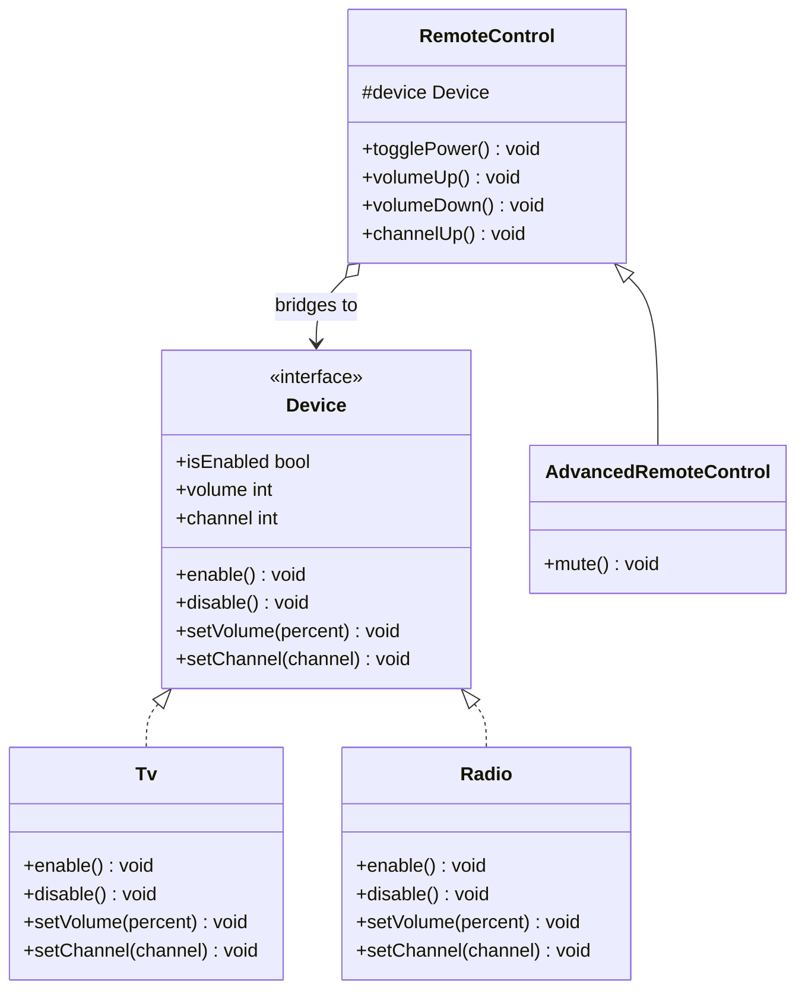

# 🌉 Bridge Pattern

**Category:** Structural

> Decouples an abstraction from its implementation so the two can vary
> independently.

## The Problem

A universal-remote app supports several remote types (basic, advanced,
voice) and several device types (TV, Radio, DVD player). Model each
combination as its own class and the count explodes — and every new device
or every new remote feature multiplies the classes you already have:

```dart
class BasicTvRemote { /* ... */ }
class BasicRadioRemote { /* ... */ }
class AdvancedTvRemote { /* ... */ }
class AdvancedRadioRemote { /* ... */ }
// add a DVD player, or a "voice" remote, and the class count multiplies
// again — every remote type times every device type
```

Adding one new device type means writing a new subclass for *every*
existing remote type, and adding one new remote feature means writing it
into every device-specific subclass separately. The two things that are
actually changing — "what the remote can do" and "what the device can do"
— are welded together into a single class hierarchy, so neither can grow on
its own.

**Real-world analogy:** a universal remote and the devices it controls. The
remote (TV, DVD, or advanced-features remote) doesn't know or care whether
it's driving a Sony or a Samsung set — it just calls `powerOn()`,
`volumeUp()`. Each manufacturer implements those operations however its own
hardware requires. The remote you hold and the device it points at are two
separate hierarchies that vary independently, connected by a shared,
narrow interface.

## How It Works

1. Define an **Implementor interface** that captures the low-level
   operations concrete implementations must provide (here, `Device`).
2. Implement one or more **ConcreteImplementors** — the actual devices
   (`Tv`, `Radio`) — each satisfying `Device` in its own way.
3. Define an **Abstraction** that holds a reference to an Implementor and
   expresses its own operations in terms of it (`RemoteControl`), rather
   than in terms of any specific device.
4. Optionally define **RefinedAbstractions** that extend the Abstraction
   with extra behavior (`AdvancedRemoteControl`), still built purely on top
   of the Implementor interface.
5. The Abstraction and the Implementor are connected by composition (the
   "bridge"), not inheritance — so a new device needs no changes to any
   remote class, and a new remote needs no changes to any device class.

Mapped to this example: `RemoteControl` holds a `Device` and expresses
`togglePower()`, `volumeUp()`, and `channelUp()` purely in terms of that
interface. Swapping in a `Radio` instead of a `Tv` requires no changes to
`RemoteControl` at all, and `AdvancedRemoteControl` adds `mute()` on top
without knowing or caring which device it's ultimately driving.

## Class Diagram



## Practical Examples

### Example 1: Simple illustrative example

Two shapes and two rendering styles, combined freely without one hierarchy
per combination — just the pattern's bare mechanics.

```dart
// Implementor: how a shape actually gets drawn.
abstract class Renderer {
  void renderCircle(double radius);
}

// ConcreteImplementors: two unrelated drawing back-ends.
class VectorRenderer implements Renderer {
  @override
  void renderCircle(double radius) =>
      print('Drawing a circle of radius $radius as vector paths.');
}

class RasterRenderer implements Renderer {
  @override
  void renderCircle(double radius) =>
      print('Drawing a circle of radius $radius as pixels.');
}

// Abstraction: a shape, expressed in terms of whatever renderer it holds.
abstract class Shape {
  Shape(this.renderer);
  final Renderer renderer;
  void draw();
}

// RefinedAbstraction: one concrete kind of shape.
class Circle extends Shape {
  Circle(this.radius, Renderer renderer) : super(renderer);
  final double radius;

  @override
  void draw() => renderer.renderCircle(radius);
}

void main() {
  final vectorCircle = Circle(5, VectorRenderer());
  final rasterCircle = Circle(5, RasterRenderer());

  vectorCircle.draw();
  rasterCircle.draw();
}
```

### Example 2: Realistic, production-like example

Cross-channel notifications: the same message *types* (abstraction) can be
sent over any delivery *channel* (implementation), and either side can grow
without touching the other.

```dart
// Implementor: how a message actually gets delivered.
abstract class MessageSender {
  Future<void> send(String recipient, String body);
}

// ConcreteImplementors: unrelated delivery mechanisms.
class EmailSender implements MessageSender {
  @override
  Future<void> send(String recipient, String body) async {
    print('Emailing $recipient: "$body"');
  }
}

class SmsSender implements MessageSender {
  @override
  Future<void> send(String recipient, String body) async {
    print('Texting $recipient: "$body"');
  }
}

// Abstraction: a notification, expressed in terms of whatever sender it holds.
abstract class Notification {
  Notification(this.sender);
  final MessageSender sender;
  Future<void> notify(String recipient);
}

// RefinedAbstraction: adds an urgency prefix, regardless of channel.
class UrgentNotification extends Notification {
  UrgentNotification(this.message, MessageSender sender) : super(sender);
  final String message;

  @override
  Future<void> notify(String recipient) =>
      sender.send(recipient, 'URGENT: $message');
}

// RefinedAbstraction: adds a routine prefix, regardless of channel.
class RoutineNotification extends Notification {
  RoutineNotification(this.message, MessageSender sender) : super(sender);
  final String message;

  @override
  Future<void> notify(String recipient) =>
      sender.send(recipient, 'FYI: $message');
}

void main() async {
  final urgentByEmail = UrgentNotification('server is down', EmailSender());
  final routineBySms = RoutineNotification('deploy finished', SmsSender());

  await urgentByEmail.notify('oncall@example.com');
  await routineBySms.notify('+1-555-0100');
}
```

## How It's Structured Here

- [classes/device.dart](classes/device.dart) — the `Device` interface: the
  Implementor shared by every concrete device.
- [classes/tv.dart](classes/tv.dart) and
  [classes/radio.dart](classes/radio.dart) — `Tv` and `Radio`, two
  unrelated ConcreteImplementors satisfying `Device` in their own way.
- [classes/remote_control.dart](classes/remote_control.dart) —
  `RemoteControl`, the Abstraction. Holds a `Device` and expresses
  power/volume/channel operations purely through that interface.
- [classes/advanced_remote_control.dart](classes/advanced_remote_control.dart)
  — `AdvancedRemoteControl`, a RefinedAbstraction adding `mute()` on top of
  `RemoteControl`, still device-agnostic.
- [main.dart](main.dart) — drives a `Tv` and a `Radio` with the same
  `RemoteControl`, then drives a `Tv` with `AdvancedRemoteControl`, showing
  both sides of the bridge varying independently.

## When to Use

- You want to avoid a permanent binding between an abstraction and its
  implementation — for example, to choose or swap the implementation at
  runtime.
- Both the abstraction and its implementation should be independently
  extensible via subclassing, without every new abstraction subclass also
  needing a matching implementation subclass (and vice versa).
- Changes in the implementation shouldn't force recompiling or changing
  client code that depends only on the abstraction.
- You're facing a combinatorial explosion of subclasses from trying to
  cover every abstraction/implementation pairing in one hierarchy (the
  motivating problem above).

## When NOT to Use

- There's only one implementation and no realistic prospect of a second —
  the extra Implementor interface and indirection buys nothing over a
  single concrete class.
- The abstraction and implementation are tightly, permanently coupled by
  their nature — forcing a bridge between things that will never vary
  independently just adds ceremony.
- The added indirection makes an already-simple design harder to follow for
  no forward-looking benefit — Bridge is worth its complexity only when
  independent variation is a real, expected requirement.

## Related Patterns

| Pattern | Relationship |
|---|---|
| [Adapter](../8-adapter/README.md) | Adapter is applied *after the fact*, to make incompatible existing interfaces work together; Bridge is designed in *up front*, so abstraction and implementation can vary independently from the start. |
| [Abstract Factory](../5-abstract-factory/README.md) | Can work together — an Abstract Factory can be used to create and configure the right Implementor for a Bridge, keeping the client from knowing which concrete implementation it received. |
| [Strategy](../1-strategy/README.md) | Structurally similar (both favor composition over inheritance to swap behavior), but Strategy is about swapping one *algorithm*, while Bridge is about decoupling two whole, independently-varying *hierarchies*. |
| [Facade](../9-facade/README.md) | Different intent — Facade adds a new, simplified interface in front of an existing subsystem; Bridge splits an abstraction and its implementation into two hierarchies connected by a stable interface. |

## Key Takeaway

Bridge favors **composition over inheritance**: instead of building one
inheritance tree that tries to capture every abstraction/implementation
combination, split it into two smaller hierarchies — an Abstraction and an
Implementor — joined by object composition. Each hierarchy can then grow on
its own; `RemoteControl` never needs to change when a new `Device` shows
up, and `Tv` never needs to change when a new kind of remote shows up,
because neither one depends on the other's concrete class — only on the
shared interface that bridges them.
