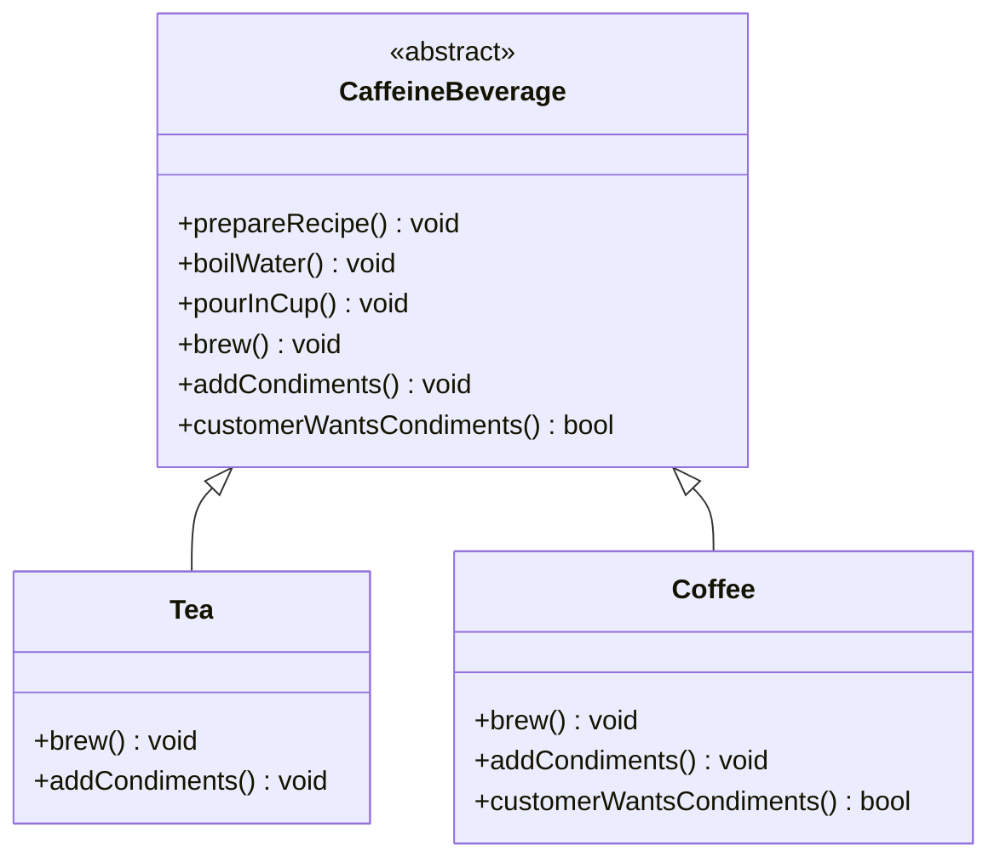

# ☕ Template Method Pattern

**Category:** Behavioral

> Defines the skeleton of an algorithm in a base class, deferring some steps
> to subclasses so they can redefine certain steps without changing the
> algorithm's overall structure.

## The Problem

A coffee shop app makes tea and coffee. Both drinks are brewed almost the
same way — boil water, brew, pour into a cup, add condiments — but each
class writes out the whole recipe on its own:

```dart
class Tea {
  void prepareRecipe() {
    print('Boiling water.');
    print('Steeping the tea.');
    print('Pouring into cup.');
    print('Adding lemon.');
  }
}

class Coffee {
  void prepareRecipe() {
    print('Boiling water.');
    print('Dripping coffee through filter.');
    print('Pouring into cup.');
    print('Adding sugar and milk.');
  }
}
// add Hot Chocolate, Cider, decaf variants... and "boil water" /
// "pour into cup" get retyped, and re-reviewed, in every single one
```

`boilWater()` and `pourInCup()` are copy-pasted into every beverage even
though they never change. Worse, nothing stops a future class from
reordering the steps, forgetting to pour into the cup, or drifting slightly
from the shared shape of the recipe — because there's no single place that
owns "this is what preparing a beverage looks like." The steps that are
genuinely shared and the steps that genuinely vary are tangled together in
every subclass, so keeping them consistent is a matter of discipline, not
of design.

**Real-world analogy:** a recipe card for "brew a hot beverage." The card
lists fixed steps — boil water, pour into cup — in a fixed order, but
leaves blanks for "brew" and "add condiments" for whoever's actually making
tea or coffee to fill in. You don't rewrite the whole card for every drink;
you follow the same card and fill in only the parts that differ.

## How It Works

1. Define an **AbstractClass** that implements a **template method** — a
   method that lays out the fixed sequence of steps of an algorithm
   (`CaffeineBeverage.prepareRecipe()`), and mark it non-overridable so
   subclasses can't rearrange the sequence.
2. Some of those steps are **primitive operations** — abstract methods with
   no implementation in the base class — that each **ConcreteClass** must
   supply (`brew()`, `addCondiments()`).
3. Other steps may already have a sensible default implementation in the
   AbstractClass itself, shared by every subclass as-is (`boilWater()`,
   `pourInCup()`).
4. Optionally, the AbstractClass can define **hook methods** — steps with a
   default (often no-op or a default answer) implementation that
   subclasses *may* override, but don't have to
   (`customerWantsCondiments()`).
5. The AbstractClass calls the subclass's steps from inside the template
   method, never the other way around — subclasses don't call the
   algorithm, the algorithm calls them (the Hollywood Principle).

Mapped to this example: `CaffeineBeverage.prepareRecipe()` is the template
method — `final` in spirit, called as-is by every beverage. `boilWater()`
and `pourInCup()` are shared steps with a default implementation. `brew()`
and `addCondiments()` are primitive operations that `Tea` and `Coffee` each
implement in their own way. `customerWantsCondiments()` is a hook:
`Tea` leaves it at its default (`true`), while `Coffee` overrides it so a
customer can skip condiments entirely without touching `prepareRecipe()`.

## Class Diagram



## Practical Examples

### Example 1: Simple illustrative example

A generic sort routine whose overall shape — compare, swap, repeat — never
changes, but the comparison itself is deferred to subclasses. Just the
pattern's bare mechanics.

```dart
// AbstractClass: owns the template method.
abstract class BubbleSorter {
  // Template method: fixed algorithm shape, not meant to be overridden.
  void sort(List<int> items) {
    for (var pass = 0; pass < items.length - 1; pass++) {
      for (var i = 0; i < items.length - 1 - pass; i++) {
        if (shouldSwap(items[i], items[i + 1])) {
          final tmp = items[i];
          items[i] = items[i + 1];
          items[i + 1] = tmp;
        }
      }
    }
    afterSort(items);
  }

  // Primitive operation: how to decide two elements are out of order.
  bool shouldSwap(int a, int b);

  // Hook: subclasses may report on the result, or do nothing.
  void afterSort(List<int> items) {}
}

// ConcreteClass: ascending order, with a status hook.
class AscendingSorter extends BubbleSorter {
  @override
  bool shouldSwap(int a, int b) => a > b;

  @override
  void afterSort(List<int> items) => print('Sorted ascending: $items');
}

// ConcreteClass: descending order, default (no-op) hook.
class DescendingSorter extends BubbleSorter {
  @override
  bool shouldSwap(int a, int b) => a < b;
}

void main() {
  AscendingSorter().sort([5, 2, 8, 1, 9]);
  DescendingSorter().sort([5, 2, 8, 1, 9]);
}
```

### Example 2: Realistic, production-like example

A data-import pipeline: every source is read, parsed, and saved the same
way, but the parsing logic differs per format, and validation is an
optional step some sources can skip.

```dart
// AbstractClass: owns the template method for the whole import pipeline.
abstract class DataImporter {
  DataImporter(this.sourceName);

  final String sourceName;

  // Template method: fixed pipeline shape, not meant to be overridden.
  Future<void> importData() async {
    final raw = await readSource();
    final records = parse(raw);
    if (shouldValidate()) {
      validate(records);
    }
    await save(records);
    print('Import from $sourceName complete: ${records.length} record(s).');
  }

  Future<String> readSource() async {
    print('Reading raw data from $sourceName.');
    return 'raw-bytes-from-$sourceName';
  }

  Future<void> save(List<String> records) async {
    print('Saving ${records.length} record(s) to the database.');
  }

  // Primitive operation: format-specific parsing.
  List<String> parse(String raw);

  // Primitive operation: format-specific validation rules.
  void validate(List<String> records);

  // Hook: most sources want validation, but not all of them.
  bool shouldValidate() => true;
}

// ConcreteClass: CSV import, validates every row.
class CsvImporter extends DataImporter {
  CsvImporter() : super('customers.csv');

  @override
  List<String> parse(String raw) => ['row-1', 'row-2', 'row-3'];

  @override
  void validate(List<String> records) =>
      print('Validating ${records.length} CSV row(s) against the schema.');
}

// ConcreteClass: trusted internal feed, skips validation via the hook.
class InternalFeedImporter extends DataImporter {
  InternalFeedImporter() : super('internal-feed');

  @override
  List<String> parse(String raw) => ['event-1', 'event-2'];

  @override
  void validate(List<String> records) {
    // Never called: shouldValidate() returns false for this source.
  }

  @override
  bool shouldValidate() => false;
}

Future<void> main() async {
  await CsvImporter().importData();
  await InternalFeedImporter().importData();
}
```

## How It's Structured Here

- [classes/caffeine_beverage.dart](classes/caffeine_beverage.dart) — the
  `CaffeineBeverage` AbstractClass: owns the `prepareRecipe()` template
  method, the shared `boilWater()`/`pourInCup()` steps, the abstract
  `brew()`/`addCondiments()` primitive operations, and the
  `customerWantsCondiments()` hook.
- [classes/tea.dart](classes/tea.dart) — `Tea`, a ConcreteClass supplying
  tea-specific steps and leaving the hook at its default.
- [classes/coffee.dart](classes/coffee.dart) — `Coffee`, a ConcreteClass
  supplying coffee-specific steps and overriding the hook so condiments can
  be skipped per instance.
- [main.dart](main.dart) — runs the same `prepareRecipe()` algorithm over
  `Tea`, `Coffee`, and a condiment-free `Coffee`, showing the fixed steps,
  the varying steps, and the hook all in action.

## When to Use

- Several classes implement the same overall algorithm, differing only in
  a few specific steps, and that duplication is spreading across classes.
- You want to control the exact points where subclasses are allowed to
  vary behavior, while keeping the rest of the algorithm's structure fixed
  and enforced in one place.
- You want to factor out shared code to avoid duplication (a classic use
  of inheritance for reuse), while still leaving room for controlled
  customization via optional hooks.

## When NOT to Use

- The steps that vary between "subclasses" aren't really steps of one
  shared algorithm — forcing unrelated behaviors into a common template
  just to reuse a little code creates an artificial hierarchy.
- You need to swap the *entire* algorithm at runtime, not just a few steps
  of it — Strategy (composition) fits that better than inheritance.
- The language or codebase favors composition over inheritance for this
  kind of variation, or subclassing is otherwise awkward or discouraged
  here.

## Related Patterns

| Pattern | Relationship |
|---|---|
| [Strategy](../1-strategy/README.md) | Template Method uses **inheritance** to let subclasses override specific steps of a fixed algorithm; Strategy uses **composition** to swap out the *entire* algorithm as an interchangeable object. Similar goal (varying behavior), opposite mechanism. |
| [Factory Method](../4-factory-method/README.md) | Factory Method is itself a specialization of Template Method — it's a single step (object creation) deferred to subclasses. A template method's algorithm often calls a factory method internally to obtain the objects it needs at one particular step. |

## Key Takeaway

Template Method follows the **Hollywood Principle**: "don't call us, we'll
call you." Subclasses never drive the algorithm — they just fill in the
blanks that the AbstractClass calls into at the right moments. This turns
inheritance into a tool for **algorithm reuse**: the shared shape and the
steps that never change live in exactly one place, `prepareRecipe()` stays
correct and consistent for every beverage, and each subclass's job shrinks
down to only the handful of steps that actually make it different.
