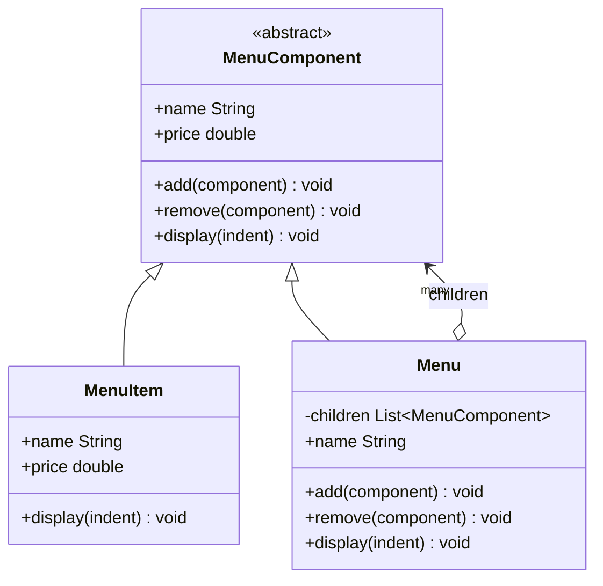

# 🌳 Composite Pattern

**Category:** Structural

> Composes objects into tree structures to represent part-whole hierarchies,
> letting clients treat individual objects and compositions of objects
> uniformly.

## The Problem

A diner is building a menu UI. A menu has items — `MenuItem("Waffles",
3.59)` — but it also has submenus, like a `Dessert Menu` nested inside the
`Diner Menu`. The client code that prints the whole thing has to know,
at every level, whether it's looking at a single item or a whole submenu,
and branch accordingly:

```dart
void printMenu(Object entry) {
  if (entry is MenuItem) {
    print('${entry.name} - \$${entry.price}');
  } else if (entry is Menu) {
    print(entry.name);
    for (final child in entry.items) {
      printMenu(child); // child might itself be a MenuItem or a Menu...
    }
  }
  // and every new "kind of menu entry" means another branch, everywhere
  // this check is duplicated across the codebase
}
```

Every place that walks the menu — printing it, computing a total price,
searching for a dish — needs its own copy of this `is MenuItem` /
`is Menu` check, and every one of those call sites breaks the moment a
third kind of entry shows up (a "combo" that bundles items, say). The
client is doing the composite's job: recursively figuring out what it's
looking at, instead of just asking it to print itself.

**Real-world analogy:** a file system. A folder can contain files, or it
can contain other folders which themselves contain files and more
folders, arbitrarily deep. When you ask for a folder's total size, you
don't manually check "is this a file or another folder" at every level —
you just ask each entry for its size, and folders know to ask their own
children the same question. Individual files and whole folder trees answer
to the exact same question.

## How It Works

1. Define a **Component interface** that both individual objects and
   groups of objects implement — the single vocabulary the client is
   allowed to use (`MenuComponent`).
2. Implement a **Leaf** — an object with no children, representing an
   individual thing (`MenuItem`). It implements only the operations that
   make sense for something with no children.
3. Implement a **Composite** — an object that holds a collection of
   `MenuComponent` children, which can themselves be Leaves or other
   Composites (`Menu`). It implements the shared operations by delegating
   to each child in turn.
4. The **Client** talks only to the Component interface. It never checks
   whether a given `MenuComponent` is a `MenuItem` or a `Menu` — it just
   calls `display()` (or `add()`, or whatever the interface offers) and lets
   each object handle it appropriately, recursing automatically wherever a
   Composite is involved.

Mapped to this example: `MenuComponent` is the Component, with default
implementations that throw for operations a given kind of node doesn't
support. `MenuItem` is the Leaf — a single dish with a name and price.
`Menu` is the Composite — it holds a list of `MenuComponent` children
(which may be `MenuItem`s, or other `Menu`s nested arbitrarily deep) and
implements `add()`, `remove()`, and `display()` by delegating to them.
`main.dart` builds a tree of menus and submenus and prints the entire
thing with a single `allMenus.display('')` call, never once asking whether
a given node is a leaf or a composite.

## Class Diagram



## Practical Examples

### Example 1: Simple illustrative example

A group of shapes that can itself contain other groups of shapes — just
the pattern's bare mechanics, no menus involved.

```dart
// Component: the shared interface for a single shape or a group of shapes.
abstract class Graphic {
  void draw(String indent);
}

// Leaf: a single shape with no children.
class Dot extends Graphic {
  Dot(this.x, this.y);
  final double x;
  final double y;

  @override
  void draw(String indent) => print('${indent}Dot at ($x, $y)');
}

// Composite: a group of graphics, which may include other groups.
class CompoundGraphic extends Graphic {
  final List<Graphic> _children = [];

  void add(Graphic child) => _children.add(child);

  @override
  void draw(String indent) {
    print('${indent}Group:');
    for (final child in _children) {
      child.draw('$indent  ');
    }
  }
}

void main() {
  final innerGroup = CompoundGraphic()
    ..add(Dot(1, 1))
    ..add(Dot(2, 2));

  final outerGroup = CompoundGraphic()
    ..add(Dot(0, 0))
    ..add(innerGroup);

  outerGroup.draw('');
}
```

### Example 2: Realistic, production-like example

A file-system tree of files and directories, where asking a directory for
its total size transparently sums whatever files and subdirectories it
contains.

```dart
// Component: the shared interface for files and directories.
abstract class FileSystemEntry {
  String get name;
  int get sizeInBytes;
  void printTree(String indent);
}

// Leaf: a single file. Its size is just its own size.
class FileEntry implements FileSystemEntry {
  FileEntry(this.name, this.sizeInBytes);

  @override
  final String name;

  @override
  final int sizeInBytes;

  @override
  void printTree(String indent) => print('$indent$name (${sizeInBytes}B)');
}

// Composite: a directory. Its size is the sum of its children's sizes,
// computed recursively without knowing which children are files and which
// are subdirectories.
class DirectoryEntry implements FileSystemEntry {
  DirectoryEntry(this.name);

  @override
  final String name;

  final List<FileSystemEntry> _children = [];

  void add(FileSystemEntry entry) => _children.add(entry);

  @override
  int get sizeInBytes =>
      _children.fold(0, (sum, child) => sum + child.sizeInBytes);

  @override
  void printTree(String indent) {
    print('$indent$name/ (${sizeInBytes}B total)');
    for (final child in _children) {
      child.printTree('$indent  ');
    }
  }
}

void main() {
  final src = DirectoryEntry('src')
    ..add(FileEntry('main.dart', 1200))
    ..add(FileEntry('utils.dart', 480));

  final project = DirectoryEntry('project')
    ..add(src)
    ..add(FileEntry('README.md', 350));

  project.printTree('');
  print('Total project size: ${project.sizeInBytes} bytes');
}
```

## How It's Structured Here

- [classes/menu_component.dart](classes/menu_component.dart) — the
  `MenuComponent` interface: the Component shared by leaves and
  composites, with default implementations that throw for operations a
  particular kind of node doesn't support.
- [classes/menu_item.dart](classes/menu_item.dart) — `MenuItem`, the Leaf.
  A single dish with a name and price and no children.
- [classes/menu.dart](classes/menu.dart) — `Menu`, the Composite. Holds a
  list of `MenuComponent` children — `MenuItem`s or nested `Menu`s — and
  implements `add()`, `remove()`, and `display()` by delegating to them.
- [main.dart](main.dart) — builds a tree of menus and submenus, then
  prints the whole structure, and demonstrates removing a submenu, all
  through the single `MenuComponent` interface.

## When to Use

- You need to represent part-whole hierarchies of objects — trees where
  any node might be a single item or a group of items.
- You want client code to treat individual objects and compositions of
  objects uniformly, without special-casing which one it's dealing with.
- The structure can be arbitrarily deep, and you don't want traversal
  logic duplicated at every call site that walks it.

## When NOT to Use

- The domain genuinely has no recursive part-whole structure — forcing a
  Composite tree onto a flat, fixed set of objects adds indirection for no
  benefit.
- The Component interface would end up wildly different for leaves versus
  composites, forcing most operations to throw or no-op — at that point
  the shared interface is more misleading than helpful.
- Type safety matters more than uniformity — a Composite's `add()`/
  `remove()` on a Leaf is usually only checkable at runtime, which some
  designs can't tolerate.

## Related Patterns

| Pattern | Relationship |
|---|---|
| [Decorator](../3-decorator/README.md) | Both are structurally recursive trees of objects sharing a common interface, but Decorator wraps and adds responsibilities to a *single* object one layer at a time, while Composite treats a whole *group* of objects and an individual object uniformly. |
| [Iterator](../14-iterator/README.md) | Commonly paired with Composite: an Iterator provides a uniform way to walk a Composite's tree of children without exposing its internal (often recursive) structure to the client. |

## Key Takeaway

Composite lets a client call the same operation on a single object or on
an entire tree of objects, without ever asking which one it has. Pushing
the "is this a leaf or a group?" branching *into* the objects themselves —
via a shared Component interface — means `Menu.display()` never needs to
know whether a given child is a `MenuItem` or another `Menu`; it just
calls `display()` and lets that child do the right thing, recursing as deep
as the tree goes. The client, and every future operation added to the
Component interface, gets that uniformity for free.
