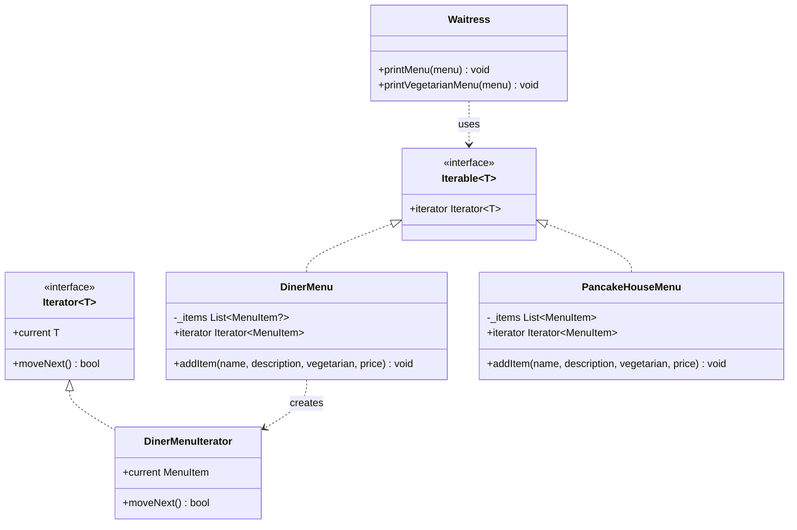

# 🔁 Iterator Pattern

**Category:** Behavioral

> Provides a way to access the elements of an aggregate object sequentially
> without exposing its underlying representation.

## The Problem

Two restaurants merge. The Pancake House keeps its menu in a growable
`List<MenuItem>`. The Diner keeps its menu in a fixed-size array with up to
6 slots, some of which may be empty. A single `Waitress` needs to print
both menus — but each menu's storage forces its own traversal code:

```dart
void printPancakeHouseMenu(List<MenuItem> items) {
  for (var i = 0; i < items.length; i++) {
    print(items[i]);
  }
}

void printDinerMenu(List<MenuItem?> items) {
  for (var i = 0; i < items.length; i++) {
    if (items[i] != null) {
      print(items[i]);
    }
  }
}
```

The waitress class now has to know that one menu is a `List` and the other
is a fixed array with possible gaps, and carry a different loop for each.
Every time a third menu shows up — backed by a `Map`, a linked list,
whatever the next acquisition uses — she needs yet another traversal
method. The thing that should be a implementation detail of each menu (how
it stores its items) has leaked into the client that just wants to print
them.

**Real-world analogy:** a TV remote's channel-up button. You don't care
whether the set stores its channel list as an array, a database row, or
something fetched over the network — you press one button and get the next
channel. The remote (client) is handed a uniform way to step through
"whatever comes next," and the traversal logic lives entirely on the far
side of that button, not in your hand.

## How It Works

1. Define an **Iterator interface** with a way to check whether there's a
   next element and a way to retrieve it (`hasNext()` / `next()` in the
   classic form; Dart's built-in `Iterator<T>` expresses the same idea as
   `moveNext()` + a `current` getter).
2. Implement one or more **ConcreteIterators**, each one knowing how to
   walk one specific aggregate's internal storage — and only that.
3. Define an **Aggregate interface** with a factory method,
   `createIterator()`, that hands back a fresh iterator over the
   aggregate's elements (Dart's built-in `Iterable<T>` plays this role,
   with its `iterator` getter standing in for `createIterator()`).
4. Implement one or more **ConcreteAggregates** — the actual collections —
   each returning the right ConcreteIterator for its own storage.
5. Client code talks only to the Iterator and Aggregate interfaces, so it
   can traverse any ConcreteAggregate the same way, never touching its
   internal representation.

Mapped to this example: `PancakeHouseMenu` and `DinerMenu` both realize
`Iterable<MenuItem>` (the Aggregate role), each exposing an `iterator`
getter (the `createIterator()` factory method) that returns the right
`Iterator<MenuItem>` for its own storage. `DinerMenuIterator` is the
ConcreteIterator that knows how to skip empty slots in the diner's fixed
array; the pancake house menu just delegates to the growable `List`'s own
iterator. `Waitress` — the client — only ever calls `for (final item in
menu)`, which works identically over either menu because both satisfy the
same `Iterable<MenuItem>` interface.

## Class Diagram



## Practical Examples

### Example 1: Simple illustrative example

A tiny custom collection with its own iterator — the pattern's bare
mechanics, no menus attached.

```dart
// ConcreteIterator: walks the collection's backing array front to back.
class NameIterator implements Iterator<String> {
  NameIterator(this._names) : _index = -1;

  final List<String> _names;
  int _index;

  @override
  String get current => _names[_index];

  @override
  bool moveNext() {
    _index++;
    return _index < _names.length;
  }
}

// ConcreteAggregate: hides its storage behind Iterable's `iterator` getter,
// which plays the role of createIterator().
class NameCollection implements Iterable<String> {
  final List<String> _names = [];

  void add(String name) => _names.add(name);

  @override
  Iterator<String> get iterator => NameIterator(_names);

  // The remaining Iterable members aren't needed for this illustration;
  // real code would mix in IterableMixin instead of stubbing them out.
  @override
  dynamic noSuchMethod(Invocation invocation) => super.noSuchMethod(invocation);
}

void main() {
  final names = NameCollection()
    ..add('Alice')
    ..add('Bob')
    ..add('Carol');

  final it = names.iterator;
  while (it.moveNext()) {
    print(it.current);
  }
}
```

### Example 2: Realistic, production-like example

The diner-menu / pancake-house-menu example in full: two menus with
genuinely incompatible internal storage, unified behind one `Waitress`.

```dart
import 'dart:collection';

class MenuItem {
  MenuItem(this.name, this.price);
  final String name;
  final double price;

  @override
  String toString() => '$name (\$${price.toStringAsFixed(2)})';
}

class DinerMenuIterator implements Iterator<MenuItem> {
  DinerMenuIterator(this._items) : _position = -1;
  final List<MenuItem?> _items;
  int _position;

  @override
  MenuItem get current => _items[_position]!;

  @override
  bool moveNext() {
    do {
      _position++;
    } while (_position < _items.length && _items[_position] == null);
    return _position < _items.length;
  }
}

class DinerMenu with IterableMixin<MenuItem> {
  final List<MenuItem?> _items = List<MenuItem?>.filled(6, null);
  int _count = 0;

  void addItem(String name, double price) {
    _items[_count] = MenuItem(name, price);
    _count++;
  }

  @override
  Iterator<MenuItem> get iterator => DinerMenuIterator(_items);
}

class PancakeHouseMenu with IterableMixin<MenuItem> {
  final List<MenuItem> _items = [];

  void addItem(String name, double price) => _items.add(MenuItem(name, price));

  @override
  Iterator<MenuItem> get iterator => _items.iterator;
}

class Waitress {
  void printMenu(Iterable<MenuItem> menu) {
    for (final item in menu) {
      print(item);
    }
  }
}

void main() {
  final pancakeHouseMenu = PancakeHouseMenu()..addItem('Waffles', 3.59);
  final dinerMenu = DinerMenu()..addItem('BLT', 2.99);

  final waitress = Waitress();
  waitress.printMenu(pancakeHouseMenu);
  waitress.printMenu(dinerMenu);
}
```

## How It's Structured Here

- [classes/menu_item.dart](classes/menu_item.dart) — `MenuItem`, the plain
  element type both menus hand out, regardless of how each stores it.
- [classes/diner_menu_iterator.dart](classes/diner_menu_iterator.dart) —
  `DinerMenuIterator`, the ConcreteIterator. Implements dart:core's
  `Iterator<MenuItem>` and knows how to skip the `null` gaps in the diner's
  fixed-size array.
- [classes/diner_menu.dart](classes/diner_menu.dart) — `DinerMenu`, a
  ConcreteAggregate backed by a fixed-size array. Mixes in `IterableMixin`
  and overrides the `iterator` getter (the `createIterator()` factory
  method) to return a `DinerMenuIterator`.
- [classes/pancake_house_menu.dart](classes/pancake_house_menu.dart) —
  `PancakeHouseMenu`, a ConcreteAggregate backed by a growable `List`. Its
  `iterator` getter simply delegates to the `List`'s own iterator, since a
  `List` is already iterable.
- [classes/waitress.dart](classes/waitress.dart) — `Waitress`, the client.
  Only ever depends on `Iterable<MenuItem>`, so the exact same code prints
  both menus and filters vegetarian items on either one.
- [main.dart](main.dart) — builds both menus, hands each to the same
  `Waitress`, and prints the combined vegetarian menu across both.

This example deliberately implements the pattern using dart:core's own
`Iterator<T>` and `Iterable<T>` (via `IterableMixin`) rather than writing a
bespoke `MenuIterator` / `Menu` interface pair from scratch. That's the
idiomatic Dart way to realize Iterator — it's built directly into the
language and its `for-in` loop syntax, so hand-rolling parallel interfaces
would just duplicate machinery the language already gives you for free.

## When to Use

- Clients need to traverse an aggregate's elements without knowing or
  depending on how it stores them internally.
- You want to support multiple, simultaneous, independent traversals over
  the same aggregate.
- You want one uniform traversal interface across several aggregates with
  genuinely different internal representations (array vs. list vs. tree),
  as with `DinerMenu` and `PancakeHouseMenu` here.
- In Dart specifically: you're implementing a custom collection type and
  want it to work with `for-in` loops and the whole `Iterable` API
  (`map`, `where`, `toList`, ...) for free.

## When NOT to Use

- You're just iterating over Dart's own built-in collections (`List`,
  `Set`, `Map`) — they already implement `Iterable`/`Iterator`; writing
  bespoke iterator classes on top adds nothing.
- The aggregate's structure is simple, fixed, and unlikely to change — a
  plain `for` loop over a `List` is clearer than ceremony around an
  Iterator interface.
- You need traversal not amenable to a linear "what's next" model (e.g.
  arbitrary tree navigation with backtracking) — a dedicated visitor or
  recursive walk may fit better than forcing it through `moveNext()`.
- Bespoke Iterator classes are worth writing in Dart mainly for two
  reasons: teaching or demonstrating the pattern's mechanics directly (as
  in Example 1 above), or unifying genuinely incompatible *external*
  collection types that don't already share an `Iterable` interface.
  Otherwise, lean on the language's built-in support.

## Related Patterns

| Pattern | Relationship |
|---|---|
| [Composite](../13-composite/README.md) | Iterator is frequently used *to traverse* a Composite tree — a tree-aware iterator can walk composites and leaves uniformly, hiding the recursive structure from the client the same way it hides array-vs-list storage here. |
| [Factory Method](../4-factory-method/README.md) | `createIterator()` on the Aggregate is itself a small Factory Method — it defers the decision of *which* concrete iterator to instantiate to each ConcreteAggregate subclass. |

## Key Takeaway

Iterator separates the responsibility of *traversing* a collection from
the collection's own responsibility of *storing* its elements — a direct
application of the Single Responsibility Principle. `DinerMenu` stays
focused on being a fixed-capacity menu; `DinerMenuIterator` is entirely
focused on the mechanics of walking it in order. Because the client only
ever depends on the shared `Iterable`/`Iterator` interfaces, each
aggregate's internal representation stays fully encapsulated — free to
change from an array to a list to anything else without ever touching the
code that traverses it.
