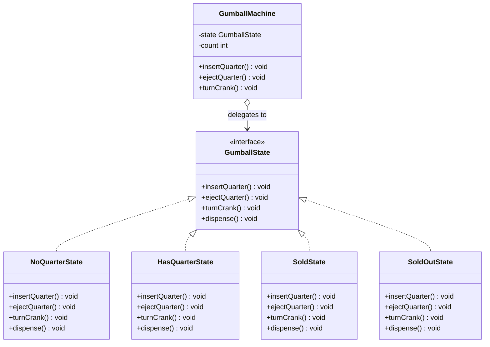

# 🚦 State Pattern

**Category:** Behavioral

> Lets an object alter its behavior when its internal state changes — the
> object will appear to change its class.

## The Problem

A gumball machine needs to behave differently depending on what's happened
so far: whether a quarter has been inserted, whether the crank has been
turned, whether it's out of gumballs. The obvious first pass is to track
the state as an enum and branch on it inside every method:

```dart
enum MachineState { noQuarter, hasQuarter, sold, soldOut }

class GumballMachine {
  MachineState state = MachineState.noQuarter;
  int count = 0;

  void insertQuarter() {
    if (state == MachineState.hasQuarter) {
      print("You can't insert another quarter.");
    } else if (state == MachineState.noQuarter) {
      state = MachineState.hasQuarter;
    } else if (state == MachineState.soldOut) {
      print("You can't insert a quarter, the machine is sold out.");
    } else if (state == MachineState.sold) {
      print('Please wait, a gumball is being dispensed.');
    }
  }

  void turnCrank() {
    if (state == MachineState.sold) {
      print("Turning twice doesn't get you another gumball.");
    } else if (state == MachineState.noQuarter) {
      print("You turned, but there's no quarter.");
    } else if (state == MachineState.soldOut) {
      print('You turned, but there are no gumballs.');
    } else if (state == MachineState.hasQuarter) {
      state = MachineState.sold;
      // ... dispense logic goes here too
    }
  }

  // ejectQuarter() and dispense() need the same four-way branch again
}
```

Every method repeats the same `if/else` chain over the same enum, and every
new state — say, a "winner" state for a promotional extra gumball — means
revisiting *every single method* to add a new branch. Miss one, and the
machine allows an invalid transition (like dispensing with no quarter
inserted) that only shows up at runtime. The state-specific logic isn't
localized anywhere; it's smeared across the whole class.

**Real-world analogy:** a vending machine's own internal wiring changes
mode depending on what's happened — insert a coin and a different set of
buttons becomes "live" than before you did. The machine's outer shell
(the buttons and slot you interact with) never changes, but which actions
actually do something, and what pressing them causes to happen next, is
entirely determined by which internal mode the machine is currently in.

## How It Works

1. Define a **State interface** that declares one method per action the
   Context can be asked to perform (here, `GumballState`).
2. Implement one **ConcreteState** class per distinct state
   (`NoQuarterState`, `HasQuarterState`, `SoldState`, `SoldOutState`), each
   providing its own behavior for every action — including simply refusing
   actions that don't make sense in that state.
3. Define a **Context** that holds a reference to the *current* State
   object and delegates every incoming call straight to it, without any
   conditional logic of its own (`GumballMachine`).
4. State transitions are triggered from *within* the ConcreteStates
   themselves — a ConcreteState decides what the next state should be and
   reassigns the Context's current state, rather than the Context
   inspecting itself and deciding.

Mapped to this example: `GumballMachine` is the Context. It holds a
`GumballState state` and forwards `insertQuarter()`, `ejectQuarter()`,
`turnCrank()`, and `dispense()` straight to whatever state is currently
installed. Each of `NoQuarterState`, `HasQuarterState`, `SoldState`, and
`SoldOutState` implements `GumballState` and knows only its own rules —
`HasQuarterState.turnCrank()`, for instance, is the only place that decides
turning the crank should move the machine into `SoldState`.

## Class Diagram



## Practical Examples

### Example 1: Simple illustrative example

A traffic light cycling through its own states — the bare mechanics, no
extra behavior layered on top.

```dart
// State: what a traffic light can be asked to do.
abstract class TrafficLightState {
  void next(TrafficLight light);
  String get name;
}

// ConcreteStates: each one knows only its own color and what comes next.
class RedState implements TrafficLightState {
  @override
  String get name => 'Red';

  @override
  void next(TrafficLight light) => light.state = GreenState();
}

class GreenState implements TrafficLightState {
  @override
  String get name => 'Green';

  @override
  void next(TrafficLight light) => light.state = YellowState();
}

class YellowState implements TrafficLightState {
  @override
  String get name => 'Yellow';

  @override
  void next(TrafficLight light) => light.state = RedState();
}

// Context: holds the current state and delegates to it.
class TrafficLight {
  TrafficLightState state = RedState();

  void change() {
    print('${state.name} -> ');
    state.next(this);
    print('now ${state.name}');
  }
}

void main() {
  final light = TrafficLight();
  for (var i = 0; i < 4; i++) {
    light.change();
  }
}
```

### Example 2: Realistic, production-like example

A document workflow: draft, in review, published, archived. Each state
decides for itself which transitions are legal, so an invalid one (like
archiving straight from draft) is simply not offered.

```dart
// State: the actions a document can be asked to perform.
abstract class DocumentState {
  void submitForReview(Document doc);
  void approve(Document doc);
  void reject(Document doc);
  void archive(Document doc);
  String get name;
}

class DraftState implements DocumentState {
  @override
  String get name => 'Draft';

  @override
  void submitForReview(Document doc) {
    print('Submitting draft for review.');
    doc.state = InReviewState();
  }

  @override
  void approve(Document doc) => print('A draft has nothing to approve yet.');

  @override
  void reject(Document doc) => print('A draft has nothing to reject yet.');

  @override
  void archive(Document doc) => print('Drafts must be submitted or discarded, not archived.');
}

class InReviewState implements DocumentState {
  @override
  String get name => 'In Review';

  @override
  void submitForReview(Document doc) => print('Already in review.');

  @override
  void approve(Document doc) {
    print('Review approved, publishing.');
    doc.state = PublishedState();
  }

  @override
  void reject(Document doc) {
    print('Review rejected, back to draft.');
    doc.state = DraftState();
  }

  @override
  void archive(Document doc) => print('Cannot archive a document mid-review.');
}

class PublishedState implements DocumentState {
  @override
  String get name => 'Published';

  @override
  void submitForReview(Document doc) => print('Already published; revise as a new draft instead.');

  @override
  void approve(Document doc) => print('Already published.');

  @override
  void reject(Document doc) => print('Cannot reject a published document.');

  @override
  void archive(Document doc) {
    print('Archiving published document.');
    doc.state = ArchivedState();
  }
}

class ArchivedState implements DocumentState {
  @override
  String get name => 'Archived';

  @override
  void submitForReview(Document doc) => print('Archived documents cannot be resubmitted.');

  @override
  void approve(Document doc) => print('Archived documents cannot be approved.');

  @override
  void reject(Document doc) => print('Archived documents cannot be rejected.');

  @override
  void archive(Document doc) => print('Already archived.');
}

// Context: holds the current state and delegates to it.
class Document {
  DocumentState state = DraftState();

  void submitForReview() => state.submitForReview(this);
  void approve() => state.approve(this);
  void reject() => state.reject(this);
  void archive() => state.archive(this);
}

void main() {
  final doc = Document();
  doc.submitForReview();
  doc.reject();
  doc.submitForReview();
  doc.approve();
  doc.archive();
  print('Final state: ${doc.state.name}');
}
```

## How It's Structured Here

- [classes/gumball_state.dart](classes/gumball_state.dart) — the
  `GumballState` interface: the State shared by every concrete machine
  state.
- [classes/no_quarter_state.dart](classes/no_quarter_state.dart),
  [classes/has_quarter_state.dart](classes/has_quarter_state.dart),
  [classes/sold_state.dart](classes/sold_state.dart), and
  [classes/sold_out_state.dart](classes/sold_out_state.dart) — the four
  ConcreteStates, each implementing `GumballState` with its own rules and
  deciding its own transitions.
- [classes/gumball_machine.dart](classes/gumball_machine.dart) —
  `GumballMachine`, the Context. Holds the current `GumballState` and
  delegates `insertQuarter()`, `ejectQuarter()`, and `turnCrank()` straight
  to it, with no conditional logic of its own.
- [main.dart](main.dart) — runs a small machine through a full life cycle:
  buying a gumball, an invalid crank turn, inserting then ejecting a
  quarter, buying the last gumball, and finally hitting sold-out.

## When to Use

- An object's behavior depends on its internal state, and that behavior
  must change at runtime as the state changes.
- Methods are full of large conditional statements that branch on the
  object's current state, and those branches are duplicated across several
  methods (the motivating problem above).
- State transitions follow well-defined rules that you want enforced in
  one place per state, rather than scattered checks across the whole class.

## When NOT to Use

- The object only has one or two states with trivial differences — a
  single boolean flag and an `if` is clearer than a State hierarchy.
- The set of states and transitions is unlikely to grow — the extra
  classes add indirection without buying future flexibility.
- Behavior doesn't actually depend on any internal state, just on input
  parameters — that's a better fit for passing a Strategy in directly than
  for modeling state at all.

## Related Patterns

| Pattern | Relationship |
|---|---|
| [Strategy](../1-strategy/README.md) | Structurally near-identical — a Context holds an interchangeable object and delegates to it — but Strategy's object is chosen once by the client and rarely changes, while State's object is swapped by the Context (or the State itself) as internal state evolves over the object's lifetime. |
| [Singleton](../6-singleton/README.md) | ConcreteState instances are often stateless themselves — all the state lives in the Context — so they're commonly implemented as Singletons and shared across every Context instance, avoiding re-allocating a new state object on every transition. |

## Key Takeaway

State replaces a pile of conditional logic keyed off an internal enum with
polymorphism: instead of every method asking "what state am I in?", each
state gets its own class that already knows how it should behave. Adding a
new state means adding a new class, not editing every existing method to
add another branch, and each state's rules — including which transitions
are even legal — stay localized in exactly one place instead of being
smeared across the whole Context.
