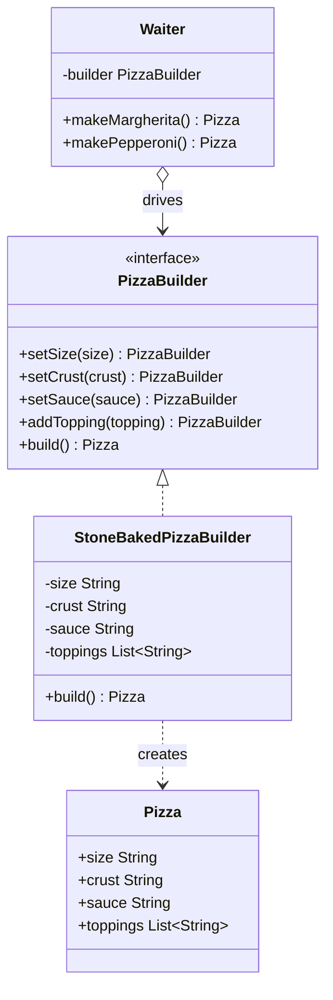

# 🧱 Builder Pattern

**Category:** Creational

> Separates the construction of a complex object from its representation, so
> the same construction process can create different representations.

## The Problem

A pizza order needs a size, a crust, a sauce, and a variable list of
toppings — some required, most optional, and the optional ones only grow in
number over time. Model that with a single constructor and you either force
every caller to pass every option, or you start overloading the constructor
for every combination anyone actually wants:

```dart
class Pizza {
  Pizza(
    String size,
    String crust,
    String sauce,
    bool extraCheese,
    bool stuffedCrust,
    bool glutenFree,
    List<String> toppings,
    bool cutInSquares,
  ) {
    // ...
  }
}

// what does `true, false, true` mean here? nobody can tell without
// flipping back to the constructor signature.
final pizza = Pizza('large', 'thin', 'tomato', true, false, true, [
  'mushroom',
], false);
```

This is the classic **telescoping constructor**: as soon as a second or
third optional combination shows up, you're either adding more constructors
that differ only in which flags they hard-code, or asking every caller to
pass positional booleans that read as noise at the call site. Nothing
enforces that a "required" field like `size` was actually set before the
object escapes into the rest of the program, and nothing stops the argument
list from growing indefinitely as the menu grows.

**Real-world analogy:** ordering a custom pizza at a counter. You don't hand
the cashier one giant sentence naming every choice in a fixed order —
you say "large, thin crust" and then add toppings one at a time as you think
of them, and the pizza doesn't exist as a finished thing until you say
"that's everything." The order-taking process is separate from what
eventually comes out of the oven, and the same process works whether you're
building a plain cheese pizza or one with every topping on the menu.

## How It Works

1. Define a **Builder interface** that exposes one method per part of the
   object being assembled, each step returning the builder itself so calls
   can be chained (`PizzaBuilder`).
2. Implement one or more **ConcreteBuilders** that accumulate state as each
   step is called, and assemble the finished object only when asked
   (`StoneBakedPizzaBuilder`).
3. Optionally define a **Director** that knows one or more standard,
   reusable sequences of builder calls, without knowing how any individual
   step is actually implemented (`Waiter`).
4. The finished **Product** is a plain object with no knowledge of how it
   was constructed — it could have come from a Director's standard recipe or
   from a client calling the builder directly (`Pizza`).
5. A client can either hand a builder to a Director for a standard build, or
   drive the same builder directly for a fully custom one — both paths
   produce a valid, fully-formed Product.

Mapped to this example: `PizzaBuilder` declares `setSize`, `setCrust`,
`setSauce`, and `addTopping`, each returning `this`; `StoneBakedPizzaBuilder`
implements those steps and turns the accumulated state into a `Pizza` in
`build()`; `Waiter` is the Director, encoding the "Margherita" and
"Pepperoni" house recipes as fixed sequences of builder calls; and `Pizza`
itself never mentions `PizzaBuilder` or `Waiter` at all.

## Class Diagram



## Practical Examples

### Example 1: Simple illustrative example

Assembling a `House` one room at a time, with a fluent builder — just the
pattern's bare mechanics.

```dart
// Product: the object being assembled.
class House {
  House({
    required this.walls,
    required this.roof,
    required this.hasGarage,
  });

  final String walls;
  final String roof;
  final bool hasGarage;

  @override
  String toString() {
    final garage = hasGarage ? 'with a garage' : 'without a garage';
    return 'A house with $walls walls, a $roof roof, $garage.';
  }
}

// Builder: one chainable step per part.
class HouseBuilder {
  String _walls = 'brick';
  String _roof = 'tiled';
  bool _hasGarage = false;

  HouseBuilder setWalls(String walls) {
    _walls = walls;
    return this;
  }

  HouseBuilder setRoof(String roof) {
    _roof = roof;
    return this;
  }

  HouseBuilder addGarage() {
    _hasGarage = true;
    return this;
  }

  House build() => House(walls: _walls, roof: _roof, hasGarage: _hasGarage);
}

void main() {
  final house = HouseBuilder()
      .setWalls('timber')
      .setRoof('slate')
      .addGarage()
      .build();

  print(house);
}
```

### Example 2: Realistic, production-like example

Assembling an outbound HTTP request: a handful of required fields, many
optional ones, and validation that only lets a well-formed request out of
`build()`.

```dart
// Product: an immutable, fully-formed request.
class HttpRequest {
  HttpRequest({
    required this.method,
    required this.url,
    required this.headers,
    required this.queryParams,
    this.body,
  });

  final String method;
  final String url;
  final Map<String, String> headers;
  final Map<String, String> queryParams;
  final String? body;

  @override
  String toString() {
    final query = queryParams.entries.map((e) => '${e.key}=${e.value}').join('&');
    final target = query.isEmpty ? url : '$url?$query';
    return '$method $target\nHeaders: $headers\nBody: ${body ?? '(none)'}';
  }
}

// Builder: required fields are constructor args, everything else is a
// chainable step, and build() refuses to hand out a malformed request.
class HttpRequestBuilder {
  HttpRequestBuilder(this._method, this._url);

  final String _method;
  final String _url;
  final Map<String, String> _headers = {};
  final Map<String, String> _queryParams = {};
  String? _body;

  HttpRequestBuilder addHeader(String key, String value) {
    _headers[key] = value;
    return this;
  }

  HttpRequestBuilder addQueryParam(String key, String value) {
    _queryParams[key] = value;
    return this;
  }

  HttpRequestBuilder setBody(String body) {
    _body = body;
    return this;
  }

  HttpRequest build() {
    if (_url.isEmpty) {
      throw StateError('A request cannot be built without a url.');
    }
    if ((_method == 'POST' || _method == 'PUT') && _body == null) {
      throw StateError('$_method requests require a body.');
    }
    return HttpRequest(
      method: _method,
      url: _url,
      headers: Map.unmodifiable(_headers),
      queryParams: Map.unmodifiable(_queryParams),
      body: _body,
    );
  }
}

void main() {
  final request = HttpRequestBuilder('POST', 'https://api.example.com/orders')
      .addHeader('Content-Type', 'application/json')
      .addHeader('Authorization', 'Bearer token123')
      .addQueryParam('notify', 'true')
      .setBody('{"item":"pizza","qty":1}')
      .build();

  print(request);
}
```

## How It's Structured Here

- [classes/pizza.dart](classes/pizza.dart) — `Pizza`, the Product. A plain,
  immutable object with no knowledge of how it was assembled.
- [classes/pizza_builder.dart](classes/pizza_builder.dart) — `PizzaBuilder`,
  the Builder interface: one chainable step per part of the pizza, plus
  `build()`.
- [classes/stone_baked_pizza_builder.dart](classes/stone_baked_pizza_builder.dart)
  — `StoneBakedPizzaBuilder`, the ConcreteBuilder. Accumulates size, crust,
  sauce, and toppings, and turns them into a `Pizza` on `build()`.
- [classes/waiter.dart](classes/waiter.dart) — `Waiter`, the Director. Knows
  the house recipes (`makeMargherita`, `makePepperoni`) as fixed sequences
  of builder calls, without knowing how any step is implemented.
- [main.dart](main.dart) — has a `Waiter` build two standard pizzas from two
  fresh builders, then has a client drive a `StoneBakedPizzaBuilder`
  directly, with no `Waiter` involved, to assemble a fully custom order.

## When to Use

- An object requires many parts to be set, most of which are optional, and a
  single constructor would either need every argument or explode into
  overloads as options grow (the telescoping-constructor problem above).
- You want the same step-by-step construction process to be able to produce
  different representations of the object.
- You want construction validated as a whole — deferring the creation of the
  final object until `build()` lets you check that everything required was
  actually supplied.
- You want a fluent, readable way to configure an object at the call site,
  instead of a wall of positional arguments.

## When NOT to Use

- The object has few fields, most of which are required — a normal
  constructor (or named parameters) is clearer and needs no extra classes.
- The construction steps never vary and there's no real need for multiple
  representations — Builder's extra indirection buys nothing over a
  constructor or a simple factory function.
- The object is naturally immutable and cheap to construct in one shot —
  reach for Builder only once the number of optional parts or the need for
  validation makes a plain constructor unwieldy.

## Related Patterns

| Pattern | Relationship |
|---|---|
| [Factory Method](../4-factory-method/README.md) | Factory Method creates a product in a single call; Builder constructs it step by step, typically through a fluent interface, and only assembles the final object when `build()` is called. |
| [Abstract Factory](../5-abstract-factory/README.md) | Abstract Factory creates whole families of related objects in one shot; Builder focuses on constructing one complex object piece by piece, and can even use an Abstract Factory internally to produce the parts it assembles. |

## Key Takeaway

Builder separates *how an object is constructed* from *what it ends up
looking like*: the same `PizzaBuilder` steps can be driven by a `Waiter`
following a fixed house recipe, or by a client composing a one-off custom
order, and either path yields a fully-formed `Pizza` that never had to
expose a constructor with eight positional parameters. Optional parts
become chained method calls instead of telescoping overloads, and the
finished object can be validated as a whole right before it's handed out —
not assembled halfway through some caller's argument list.
