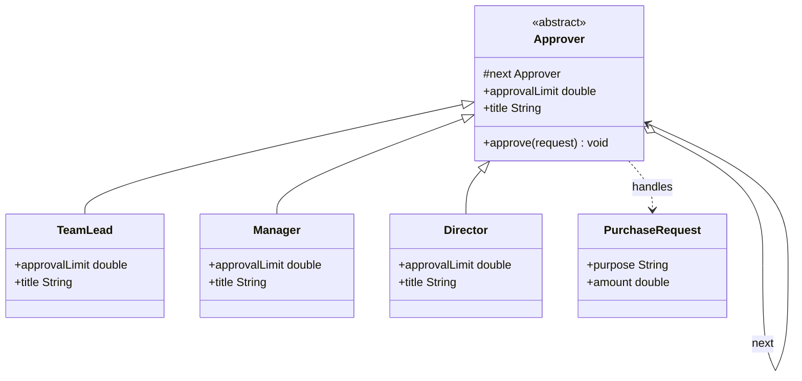

# ⛓️ Chain of Responsibility Pattern

**Category:** Behavioral

> Passes a request along a chain of potential handlers until one of them
> handles it, without the sender needing to know which one that will be.

## The Problem

A purchasing system needs to route expense approvals to whoever is
authorized to sign off on them: a team lead can approve small purchases, a
manager handles mid-sized ones, and a director signs off on the rest. The
obvious first cut is one method that checks the amount against every
threshold in turn:

```dart
void approvePurchase(String purpose, double amount) {
  if (amount <= 500) {
    print('Team Lead approves "$purpose".');
  } else if (amount <= 5000) {
    print('Manager approves "$purpose".');
  } else if (amount <= 20000) {
    print('Director approves "$purpose".');
  } else {
    print('Request "$purpose" rejected — no one can approve it.');
  }
}
```

It works, but every approver, threshold, and rule lives in one method that
has to know about all of them at once. Reordering the chain (say, adding a
VP between manager and director), skipping a step, or reusing just "the
manager's rule" elsewhere means editing this one method and re-testing every
branch — the requester's code and every approver's business rule are welded
together, and nothing can be added, removed, or reordered without touching
code that has nothing to do with it.

**Real-world analogy:** an expense-approval chain in a company. You submit a
request to your team lead. If it's within their signing limit, they approve
it and it's done — you never talk to anyone else. If it's too big, they pass
it up to their manager without you doing anything; if it's still too big,
the manager passes it up to the director. You submit the request once, to
one person, and it silently travels up the chain until someone with enough
authority handles it (or no one does).

## How It Works

1. Define a **Handler** interface (or abstract class) that declares how to
   handle a request and holds a reference to the *next* handler in the
   chain (here, `Approver`).
2. Implement one or more **ConcreteHandlers** — each decides whether it can
   handle a given request; if not, it forwards it to the next handler
   (`TeamLead`, `Manager`, `Director`).
3. The **Client** builds the chain by linking handlers together and only
   ever talks to the *first* one — it never needs to know how many handlers
   exist or which one will end up handling the request.
4. Each handler either fully handles the request and stops the chain, or
   passes it along unchanged, so handlers can be added, removed, or
   reordered without touching the client or each other.

Mapped to this example: `Approver` is the Handler, holding a nullable `next`
and implementing the forwarding logic once; `TeamLead`, `Manager`, and
`Director` are ConcreteHandlers that only need to declare their own
`approvalLimit`. `main.dart` plays the Client — it links the three approvers
together and then only ever calls `teamLead.approve(...)`, regardless of
which approver ultimately signs off.

## Class Diagram



## Practical Examples

### Example 1: Simple illustrative example

A logging chain: each logger only handles messages at or above its own
severity, otherwise it passes the message along — just the pattern's bare
mechanics.

```dart
enum LogLevel { debug, info, error }

// Handler: declares how a log message is handled and holds the next logger.
abstract class Logger {
  Logger? next;

  LogLevel get level;

  void log(LogLevel messageLevel, String message) {
    if (messageLevel.index >= level.index) {
      write(message);
    }
    next?.log(messageLevel, message);
  }

  void write(String message);
}

// ConcreteHandlers: each writes to its own destination.
class DebugLogger extends Logger {
  @override
  LogLevel get level => LogLevel.debug;

  @override
  void write(String message) => print('[DEBUG] $message');
}

class InfoLogger extends Logger {
  @override
  LogLevel get level => LogLevel.info;

  @override
  void write(String message) => print('[INFO] $message');
}

class ErrorLogger extends Logger {
  @override
  LogLevel get level => LogLevel.error;

  @override
  void write(String message) => print('[ERROR] $message');
}

void main() {
  final debugLogger = DebugLogger();
  final infoLogger = InfoLogger();
  final errorLogger = ErrorLogger();

  debugLogger.next = infoLogger;
  infoLogger.next = errorLogger;

  debugLogger.log(LogLevel.info, 'Cache warmed up.');
  debugLogger.log(LogLevel.error, 'Disk almost full.');
}
```

### Example 2: Realistic, production-like example

An HTTP-middleware-style request pipeline: each handler can short-circuit
the request (reject it outright) or pass it along to the next stage,
exactly like a real web framework's middleware chain.

```dart
class HttpRequest {
  HttpRequest({
    required this.token,
    required this.clientId,
    required this.body,
  });

  final String? token;
  final String clientId;
  final Map<String, dynamic> body;
}

class HttpResponse {
  HttpResponse(this.statusCode, this.message);

  final int statusCode;
  final String message;

  @override
  String toString() => '$statusCode: $message';
}

// Handler: works with requests and can short-circuit by returning a
// response instead of forwarding to the next handler.
abstract class Middleware {
  Middleware? next;

  HttpResponse handle(HttpRequest request) {
    final rejection = check(request);
    if (rejection != null) {
      return rejection;
    }
    if (next != null) {
      return next!.handle(request);
    }
    return HttpResponse(200, 'OK');
  }

  // Returns null to pass the request along, or a response to short-circuit.
  HttpResponse? check(HttpRequest request);
}

// ConcreteHandler: rejects unauthenticated requests.
class AuthMiddleware extends Middleware {
  @override
  HttpResponse? check(HttpRequest request) {
    if (request.token == null || request.token!.isEmpty) {
      return HttpResponse(401, 'Missing auth token');
    }
    return null;
  }
}

// ConcreteHandler: rejects clients over their request budget.
class RateLimitMiddleware extends Middleware {
  RateLimitMiddleware(this._requestCounts);

  final Map<String, int> _requestCounts;
  static const _limit = 100;

  @override
  HttpResponse? check(HttpRequest request) {
    final count = _requestCounts[request.clientId] ?? 0;
    if (count >= _limit) {
      return HttpResponse(429, 'Rate limit exceeded');
    }
    _requestCounts[request.clientId] = count + 1;
    return null;
  }
}

// ConcreteHandler: rejects malformed request bodies.
class ValidationMiddleware extends Middleware {
  @override
  HttpResponse? check(HttpRequest request) {
    if (!request.body.containsKey('email')) {
      return HttpResponse(400, 'Missing "email" field');
    }
    return null;
  }
}

void main() {
  final auth = AuthMiddleware();
  final rateLimit = RateLimitMiddleware({});
  final validation = ValidationMiddleware();

  auth.next = rateLimit;
  rateLimit.next = validation;

  final good = HttpRequest(
    token: 'valid-token',
    clientId: 'client-1',
    body: {'email': 'a@example.com'},
  );
  final noToken = HttpRequest(token: null, clientId: 'client-2', body: {});
  final badBody = HttpRequest(
    token: 'valid-token',
    clientId: 'client-3',
    body: {},
  );

  print(auth.handle(good));
  print(auth.handle(noToken));
  print(auth.handle(badBody));
}
```

## How It's Structured Here

- [classes/approver.dart](classes/approver.dart) — the `Approver` abstract
  class: the Handler. Holds the `next` link and implements the
  approve-or-forward logic once, on top of an `approvalLimit` and `title`
  each subclass provides.
- [classes/team_lead.dart](classes/team_lead.dart),
  [classes/manager.dart](classes/manager.dart), and
  [classes/director.dart](classes/director.dart) — `TeamLead`, `Manager`,
  and `Director`, the ConcreteHandlers, each declaring only its own
  approval limit and title.
- [classes/purchase_request.dart](classes/purchase_request.dart) —
  `PurchaseRequest`, the plain data object that travels along the chain.
- [main.dart](main.dart) — the Client. Links `TeamLead` → `Manager` →
  `Director` into a chain and submits every request to `teamLead` alone,
  regardless of which approver ends up handling it.

## When to Use

- More than one object might handle a request, and the handler shouldn't be
  hard-coded — it should be determined at runtime by walking the chain.
- You want to issue a request without specifying the receiver explicitly,
  decoupling the sender from whichever object ultimately handles it.
- The set of handlers, and their order, needs to change independently of
  the code that issues requests — new handlers can be inserted or removed
  without touching the client.

## When NOT to Use

- There's exactly one handler and it will always be the one to handle every
  request — a chain adds indirection with no payoff over calling it
  directly.
- Every request absolutely must be handled by something, and an unhandled
  request falling silently off the end of the chain would be a bug — that
  needs an explicit guarantee, not an implicit chain traversal.
- The chain would grow so long or so deep that debugging "which handler
  actually processed this" becomes harder than the coupling the pattern was
  meant to remove.

## Related Patterns

| Pattern | Relationship |
|---|---|
| [Command](../7-command/README.md) | Command encapsulates a request as an object; Chain of Responsibility passes a request along a line of potential handlers until one handles it. The two often work together — a `Command` can be exactly what gets passed down the chain. |
| [Composite](../13-composite/README.md) | Structurally similar — a Handler's `next` link is just like the parent/child links that hold a Composite tree together. Chain of Responsibility is sometimes built directly over a Composite structure, walking up (or down) the tree looking for a handler. |

## Key Takeaway

Chain of Responsibility decouples the sender of a request from its
receiver: the client hands a request to the *first* handler and walks away,
never knowing — or needing to know — which object in the chain will
actually deal with it, or whether more than one will look at it along the
way. Each handler stays simple, deciding only "can I handle this?" and
"who's next?", so the chain itself — its length, its order, its
membership — can change freely without the client or any other handler
noticing.
