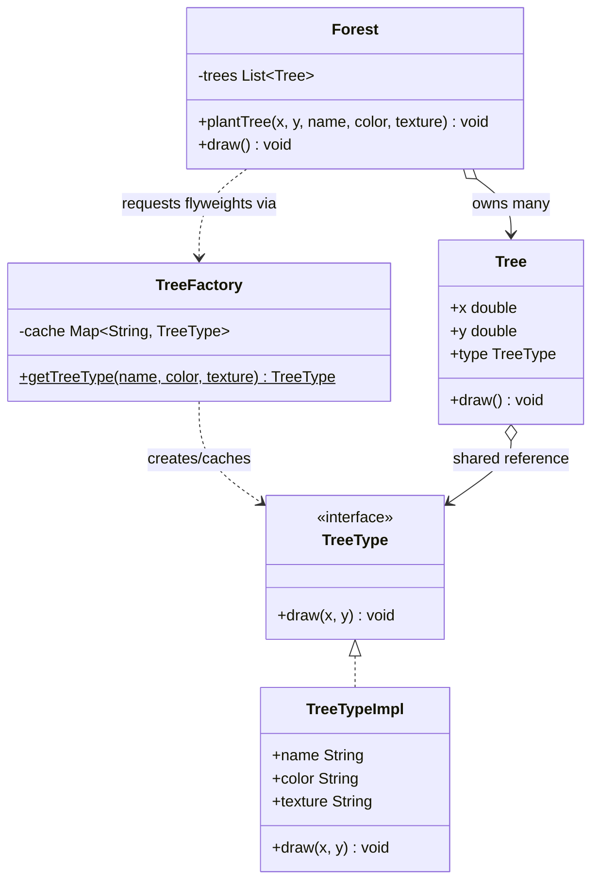

# 🌳 Flyweight Pattern

**Category:** Structural

> Uses sharing to support large numbers of fine-grained objects
> efficiently, by factoring out the state they have in common.

## The Problem

A forest-rendering app needs to draw a few million trees. The obvious
approach is one full object per tree, each carrying everything it needs to
render itself:

```dart
class Tree {
  Tree(this.x, this.y, this.name, this.color, this.texture);

  final double x;
  final double y;
  final String name;
  final String color;
  final String texture; // imagine this is megabytes of bitmap data
}

// Planting a forest of two million trees...
final forest = <Tree>[];
for (var i = 0; i < 2000000; i++) {
  forest.add(Tree(randomX(), randomY(), 'Oak', 'Green', 'Rough Bark'));
}
```

Every one of those two million `Tree` objects duplicates the *exact same*
`name`, `color`, and `texture` data — only `x` and `y` actually differ
between trees of the same species. If the texture alone is a few
megabytes, two million copies of it will exhaust memory long before the
forest finishes loading, even though there might only be a handful of
distinct tree species on screen. The data that's genuinely unique per tree
(its position) is a tiny fraction of what each object is paying to store.

**Real-world analogy:** think of an actual forest. Thousands of oak trees
share the same species characteristics — leaf shape, bark texture, typical
color — but no two oaks stand in exactly the same spot. It would be absurd
to print a full botanical reference book for every single tree; instead,
one reference book per species is shared, and each tree is just a pin on a
map pointing back to its species' book plus its own coordinates.

## How It Works

1. Define a **Flyweight interface** that describes the operations a shared
   object exposes, accepting whatever context-specific data it needs as
   parameters (`TreeType`).
2. Implement a **ConcreteFlyweight** that stores the **intrinsic
   state** — the data that's identical across every object of that kind,
   and therefore safe and worthwhile to share (`TreeTypeImpl`, holding
   `name`, `color`, `texture`).
3. Implement a **FlyweightFactory** that caches ConcreteFlyweight instances
   keyed by their intrinsic state, and returns the existing instance
   instead of constructing a new one whenever the same state is requested
   again (`TreeFactory`).
4. The **Client** keeps the **extrinsic state** — the data that's unique
   per logical object and can't be shared — separately, and passes it in
   whenever it calls the flyweight (`Tree` holding `x`/`y`, `Forest`
   holding many `Tree`s).

Mapped to this example: `TreeType` is the Flyweight interface, `TreeTypeImpl`
is the ConcreteFlyweight caching each species' shared `name`/`color`/
`texture`, `TreeFactory` hands back the same `TreeTypeImpl` instance for
every tree of a given species instead of building a new one, and `Tree`
(driven by `Forest`) supplies only the position — the extrinsic state — at
draw time.

## Class Diagram



## Practical Examples

### Example 1: Simple illustrative example

A tiny text renderer where every occurrence of a letter shares one glyph
object. The glyph's shape is intrinsic (shared); where and how big to draw
it is extrinsic (passed in at render time) — just the pattern's bare
mechanics.

```dart
// Flyweight: shared interface, extrinsic state passed as parameters.
abstract class Glyph {
  void render(int x, int fontSize);
}

// ConcreteFlyweight: intrinsic state — the character's shape — is the only
// thing stored here.
class CharacterGlyph implements Glyph {
  CharacterGlyph(this.character);
  final String character;

  @override
  void render(int x, int fontSize) {
    print('Rendering "$character" at x=$x, size=$fontSize');
  }
}

// FlyweightFactory: one glyph object per distinct character, no matter how
// many times that character appears in the text.
class GlyphFactory {
  static final Map<String, Glyph> _cache = {};

  static Glyph getGlyph(String character) {
    return _cache.putIfAbsent(character, () => CharacterGlyph(character));
  }

  static int get createdCount => _cache.length;
}

void main() {
  const text = 'banana';
  var x = 0;

  for (final char in text.split('')) {
    final glyph = GlyphFactory.getGlyph(char);
    glyph.render(x, 12);
    x += 10;
  }

  print('Characters rendered: ${text.length}');
  print('Glyph flyweights actually created: ${GlyphFactory.createdCount}');
}
```

### Example 2: Realistic, production-like example

The forest example in full: a `TreeType` flyweight holds each species'
shared name/color/texture, a `TreeFactory` caches those flyweights, and a
`Forest` plants a large number of `Tree`s that each carry only their own
coordinates plus a reference to the shared species data.

```dart
// Flyweight interface.
abstract class TreeType {
  void draw(double x, double y);
}

// ConcreteFlyweight: intrinsic (shared, immutable) state.
class TreeTypeImpl implements TreeType {
  TreeTypeImpl(this.name, this.color, this.texture);
  final String name;
  final String color;
  final String texture;

  @override
  void draw(double x, double y) {
    print('Drawing a $color $name at ($x, $y) with $texture texture.');
  }
}

// FlyweightFactory: caches ConcreteFlyweights by intrinsic state.
class TreeFactory {
  static final Map<String, TreeType> _cache = {};

  static TreeType getTreeType(String name, String color, String texture) {
    final key = '$name-$color-$texture';
    return _cache.putIfAbsent(key, () => TreeTypeImpl(name, color, texture));
  }

  static int get createdCount => _cache.length;
}

// Client-facing object: only extrinsic (per-tree) state, plus a shared
// TreeType reference.
class Tree {
  Tree(this.x, this.y, this.type);
  final double x;
  final double y;
  final TreeType type;

  void draw() => type.draw(x, y);
}

// Client: plants many trees while only ever going through the factory.
class Forest {
  final List<Tree> _trees = [];

  void plantTree(
    double x,
    double y,
    String name,
    String color,
    String texture,
  ) {
    final type = TreeFactory.getTreeType(name, color, texture);
    _trees.add(Tree(x, y, type));
  }

  void draw() {
    for (final tree in _trees) {
      tree.draw();
    }
  }

  int get treeCount => _trees.length;
}

void main() {
  final forest = Forest();

  // Plant thousands of trees from only a handful of species.
  for (var i = 0; i < 1000; i++) {
    forest.plantTree(i.toDouble(), 0, 'Oak', 'Green', 'Rough Bark');
  }
  for (var i = 0; i < 1000; i++) {
    forest.plantTree(i.toDouble(), 1, 'Pine', 'Dark Green', 'Needled');
  }
  forest.plantTree(500, 2, 'Birch', 'White', 'Smooth Bark');

  print('Logical trees planted: ${forest.treeCount}');
  print('TreeType flyweights actually created: ${TreeFactory.createdCount}');
  // 2001 trees, but only 3 TreeType objects ever get built — every tree of
  // the same species shares one instance instead of duplicating its data.
}
```

## How It's Structured Here

- [classes/tree_type.dart](classes/tree_type.dart) — the `TreeType`
  Flyweight interface, and `TreeTypeImpl`, the ConcreteFlyweight storing
  each species' intrinsic `name`/`color`/`texture`.
- [classes/tree_factory.dart](classes/tree_factory.dart) — `TreeFactory`,
  the FlyweightFactory. Caches `TreeTypeImpl` instances by their intrinsic
  state and reuses them instead of rebuilding.
- [classes/tree.dart](classes/tree.dart) — `Tree`, the client-facing
  object holding only extrinsic state (`x`, `y`) plus a reference to its
  shared `TreeType`.
- [classes/forest.dart](classes/forest.dart) — `Forest`, the client. Plants
  many `Tree`s, always going through `TreeFactory` rather than constructing
  a `TreeType` directly.
- [main.dart](main.dart) — plants a small forest with repeated species,
  draws it, then prints how many trees exist versus how many `TreeType`
  flyweights were actually created.

## When to Use

- An application needs to create a very large number of similar objects,
  and the sheer object count would otherwise exhaust memory.
- Most of an object's state can be made extrinsic (moved out to the
  caller), leaving a small amount of intrinsic state that's genuinely
  shareable across many instances.
- Object identity doesn't matter to the client — flyweights are shared, so
  clients shouldn't rely on `==` distinguishing one logical instance from
  another with the same intrinsic state.
- The cost of looking data up in the factory's cache is cheap compared to
  the memory saved by not duplicating it.

## When NOT to Use

- There aren't many objects, or they don't share much state — the factory
  and the intrinsic/extrinsic split add complexity with no memory win to
  show for it.
- Extracting extrinsic state would force it to be recomputed or passed
  around expensively every time it's needed, trading a memory problem for
  a performance one.
- The objects need genuinely independent, mutable identity — Flyweight
  assumes shared instances are effectively immutable, so anything that
  needs per-object mutable state doesn't fit.

## Related Patterns

| Pattern | Relationship |
|---|---|
| [Singleton](../6-singleton/README.md) | Singleton guarantees exactly one instance for the whole application; Flyweight's factory guarantees at most one instance *per unique intrinsic state* — so a Flyweight factory behaves like a keyed pool of mini-Singletons, one per distinct key. |
| [Composite](../13-composite/README.md) | Flyweight objects are often used as the leaf nodes of a large Composite tree, letting many leaves that share the same underlying data reduce the tree's overall memory footprint. |

## Key Takeaway

Flyweight's whole trick is splitting an object's state into **intrinsic**
state — shared, immutable, safe to hand out to thousands of callers at
once — and **extrinsic** state — context-dependent, unique per logical
object, and supplied by the caller rather than stored. A factory keeps
exactly one instance per distinct intrinsic state around and reuses it, so
an application can work with millions of fine-grained logical objects
(`Tree`s) while only ever allocating a handful of actual objects
(`TreeTypeImpl`s) to back them.
