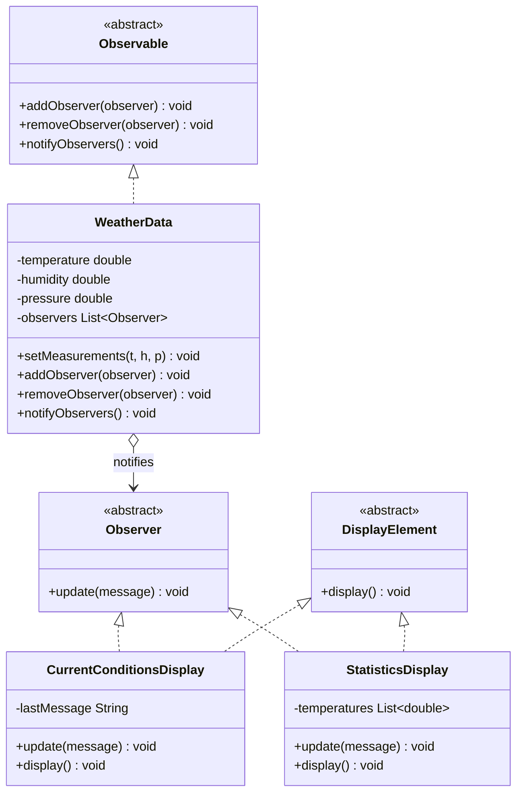

# Observer Pattern

## What it is
Defines a one-to-many dependency between objects: when one object (the
"subject"/"observable") changes state, all of its registered dependents
("observers") are notified automatically, without the subject needing to know
anything concrete about them.

## Class Diagram

## When to use it
- One piece of state changes and multiple, independent parts of the system
  need to react to that change (UI widgets, logs, caches, other services).
- You don't want the subject hard-coded to know about every specific listener
  — observers should be able to subscribe/unsubscribe at runtime.
- Classic use cases: event systems, UI data binding, pub/sub, live dashboards
  (like the weather station example used here).

## How it's structured here
- [classes/observer.dart](classes/observer.dart) — the `Observer` interface:
  anything that wants updates implements `update(message)`.
- [classes/observable.dart](classes/observable.dart) — the `Observable`
  interface: `addObserver`, `removeObserver`, `notifyObservers`.
- [classes/weather_data.dart](classes/weather_data.dart) — the concrete
  subject. Holds temperature/humidity/pressure and calls `notifyObservers()`
  whenever `setMeasurements()` is called.
- [classes/current_conditions_display.dart](classes/current_conditions_display.dart)
  and [classes/statistics_display.dart](classes/statistics_display.dart) —
  concrete observers. Each subscribes to `WeatherData` in its constructor and
  reacts differently to the same update (one shows the latest reading, the
  other tracks avg/min/max).
- [main.dart](main.dart) — registers both displays, pushes measurements, then
  removes `currentDisplay` to show that unsubscribing stops further updates
  while `statisticsDisplay` keeps receiving them independently.

## Key idea to remember
The subject never imports or references a concrete observer type — only the
`Observer` interface. That's what lets you add, remove, or swap observers
freely without ever touching `WeatherData`.
