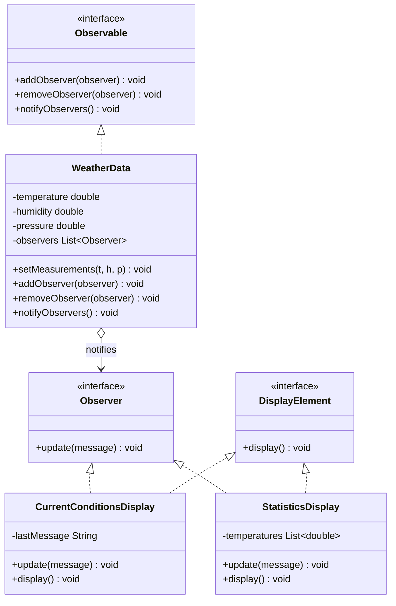

# 📰 Observer Pattern

**Category:** Behavioral

> Defines a one-to-many dependency between objects so that when one object
> changes state, all its dependents are notified and updated automatically.

## The Problem

Imagine a `WeatherData` station that measures temperature, humidity, and
pressure, and needs to update a current-conditions display, a statistics
display, and (soon) a forecast display and a logging service — every time a
new reading comes in.

The naive approach is for `WeatherData` to call each display directly:

```dart
class WeatherData {
  void measurementsChanged() {
    currentConditionsDisplay.update(temp, humidity, pressure);
    statisticsDisplay.update(temp, humidity, pressure);
    // adding a forecast display means editing this method again
    // and WeatherData now has a compile-time dependency on every display
  }
}
```

This **tightly couples** the subject to every concrete listener. Adding a
display means changing `WeatherData` itself; removing one means the same.
`WeatherData` has no business knowing what a "statistics display" even is —
its only job is to measure the weather.

**Real-world analogy:** a magazine publisher and its subscribers. The
publisher doesn't know or care who its subscribers are individually — it just
mails a new issue to whoever is currently on the subscription list. Readers
can subscribe or unsubscribe at any time, and the publisher's printing
process never changes because of it.

## How It Works

1. Define an **Observer interface** with an `update()` method that the
   subject calls when something changes.
2. Define a **Subject/Observable interface** with `addObserver`,
   `removeObserver`, and `notifyObservers`.
3. The **ConcreteSubject** keeps a list of observers and calls
   `notifyObservers()` whenever its state changes — it loops over the list
   and calls `update()` on each one, without knowing their concrete types.
4. **ConcreteObservers** implement `update()` and register themselves with
   the subject (usually in their constructor).
5. Observers can be added or removed at runtime; the subject's notification
   logic never has to change.

Mapped to this example: `WeatherData` is the subject/publisher.
`CurrentConditionsDisplay` and `StatisticsDisplay` are subscribers — each
reacts to the same `update()` call differently (one shows the latest
reading, the other tracks min/max/average).

## Class Diagram



## Practical Examples

### Example 1: Simple illustrative example

A minimal publisher/subscriber pair to see the shape of the pattern.

```dart
// Observer interface — anything that wants updates implements this.
abstract class Observer {
  void update(String event);
}

// Subject interface — manages subscribers and notifies them.
abstract class Subject {
  void subscribe(Observer observer);
  void unsubscribe(Observer observer);
  void notifyObservers(String event);
}

// Concrete subject: a simple news publisher.
class NewsPublisher implements Subject {
  final List<Observer> _subscribers = [];

  @override
  void subscribe(Observer observer) => _subscribers.add(observer);

  @override
  void unsubscribe(Observer observer) => _subscribers.remove(observer);

  @override
  void notifyObservers(String event) {
    for (final subscriber in _subscribers) {
      subscriber.update(event);
    }
  }

  void publish(String headline) {
    print('Publishing: $headline');
    notifyObservers(headline);
  }
}

// Concrete observer: prints whatever headline it receives.
class Reader implements Observer {
  Reader(this.name);
  final String name;

  @override
  void update(String event) => print('$name read: "$event"');
}

void main() {
  final publisher = NewsPublisher();
  final alice = Reader('Alice');
  final bob = Reader('Bob');

  publisher.subscribe(alice);
  publisher.subscribe(bob);
  publisher.publish('Design Patterns are fun!');

  publisher.unsubscribe(bob);
  publisher.publish('Bob will not see this headline.');
}
```

### Example 2: Realistic, production-like example

A stock ticker that notifies a portfolio tracker and a price-alert service
whenever a stock's price changes — a common pattern behind live dashboards.

```dart
// Observer interface: reacts to a price change event.
abstract class StockObserver {
  void onPriceChanged(String symbol, double oldPrice, double newPrice);
}

// Subject interface: manages a list of stock observers.
abstract class StockSubject {
  void addObserver(StockObserver observer);
  void removeObserver(StockObserver observer);
}

// Concrete subject: tracks the latest price for each symbol.
class StockTicker implements StockSubject {
  final List<StockObserver> _observers = [];
  final Map<String, double> _prices = {};

  @override
  void addObserver(StockObserver observer) => _observers.add(observer);

  @override
  void removeObserver(StockObserver observer) => _observers.remove(observer);

  void updatePrice(String symbol, double newPrice) {
    final oldPrice = _prices[symbol] ?? newPrice;
    _prices[symbol] = newPrice;
    for (final observer in _observers) {
      observer.onPriceChanged(symbol, oldPrice, newPrice);
    }
  }
}

// Concrete observer: keeps a running total of portfolio value.
class PortfolioTracker implements StockObserver {
  final Map<String, int> holdings; // symbol -> shares owned
  PortfolioTracker(this.holdings);

  @override
  void onPriceChanged(String symbol, double oldPrice, double newPrice) {
    final shares = holdings[symbol];
    if (shares == null) return;
    final delta = (newPrice - oldPrice) * shares;
    print('Portfolio: $symbol move changed value by \$${delta.toStringAsFixed(2)}');
  }
}

// Concrete observer: fires an alert when a price crosses a threshold.
class PriceAlertService implements StockObserver {
  final double threshold;
  PriceAlertService(this.threshold);

  @override
  void onPriceChanged(String symbol, double oldPrice, double newPrice) {
    if (newPrice >= threshold && oldPrice < threshold) {
      print('ALERT: $symbol crossed \$$threshold (now \$$newPrice)');
    }
  }
}

void main() {
  final ticker = StockTicker();
  final portfolio = PortfolioTracker({'ACME': 10});
  final alerts = PriceAlertService(150.0);

  ticker.addObserver(portfolio);
  ticker.addObserver(alerts);

  ticker.updatePrice('ACME', 145.0);
  ticker.updatePrice('ACME', 152.0); // triggers both observers differently
}
```

## How It's Structured Here

- [classes/observer.dart](classes/observer.dart) — the `Observer` interface:
  anything that wants updates implements `update(message)`.
- [classes/observable.dart](classes/observable.dart) — the `Observable`
  interface: `addObserver`, `removeObserver`, `notifyObservers`.
- [classes/weather_data.dart](classes/weather_data.dart) — the concrete
  subject. Holds temperature/humidity/pressure and calls `notifyObservers()`
  whenever `setMeasurements()` is called.
- [classes/current_conditions_display.dart](classes/current_conditions_display.dart)
  and [classes/statistics_display.dart](classes/statistics_display.dart) —
  concrete observers. Each subscribes to `WeatherData` in its constructor and
  reacts differently to the same update (one shows the latest reading, the
  other tracks avg/min/max).
- [main.dart](main.dart) — registers both displays, pushes measurements, then
  removes `currentDisplay` to show that unsubscribing stops further updates
  while `statisticsDisplay` keeps receiving them independently.

## When to Use

- One piece of state changes and multiple, independent parts of the system
  need to react to it (UI widgets, logs, caches, other services) — because
  each reaction can be added or removed without touching the others.
- You don't want the subject hard-coded to know about every specific
  listener — observers should be able to subscribe/unsubscribe at runtime.
- Classic use cases: event systems, UI data binding, pub/sub, live dashboards
  (like the weather station example used here).

## When NOT to Use

- Notification order or delivery guarantees matter and observers have
  interdependencies — plain Observer gives no ordering guarantees, which can
  cause subtle bugs if observer B assumes observer A already ran.
- Observers forget to unsubscribe — this is the pattern's most common
  real-world bug (a "lapsed listener" memory leak), especially in long-lived
  subjects with short-lived observers.
- The update cascades into more notifications that trigger more
  notifications — without care, Observer can hide feedback loops that are
  hard to debug because the control flow isn't visible in one place.
- You only ever have exactly one listener — a direct method call is simpler
  and easier to trace than the extra indirection of subscribe/notify.

## Related Patterns

| Pattern | Relationship |
|---|---|
| [Strategy](../1-strategy/README.md) | Structurally similar (an interface + interchangeable implementations), but Observer is about broadcasting change, not selecting an algorithm. |
| Mediator | Alternative — Mediator centralizes communication between objects through a middleman instead of direct subject-to-observer notification. |
| Publish/Subscribe | Generalizes Observer by adding a message broker between subjects and observers, decoupling them further (they don't even reference each other directly). |
| [Decorator](../3-decorator/README.md) | Complements Observer — a decorator can wrap an observer to add logging, throttling, or filtering to how it reacts to updates. |

## Key Takeaway

Observer lets a subject broadcast state changes to any number of interested
parties without ever knowing their concrete types — only the `Observer`
interface. This is the design principle **"strive for loosely coupled
designs between objects that interact"**: the subject and its observers can
vary independently, as long as they both honor the interface between them.
