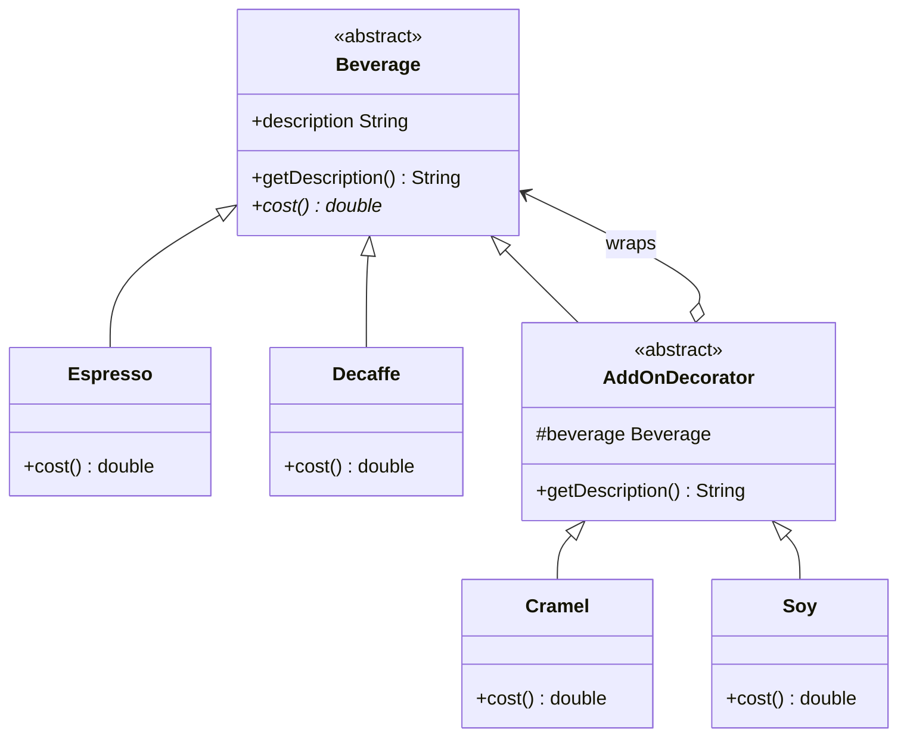

# ☕ Decorator Pattern

**Category:** Structural

> Attaches additional responsibilities to an object dynamically. Decorators
> provide a flexible alternative to subclassing for extending functionality.

## The Problem

A coffee shop sells `Espresso` and `Decaf`, each of which can optionally get
soy milk, caramel, whipped cream, and more — in any combination, any number
of times. The naive approach is subclassing every combination:

```dart
class Espresso {}
class EspressoWithSoy extends Espresso {}
class EspressoWithSoyAndCaramel extends Espresso {}
class EspressoWithCaramel extends Espresso {}
class DecafWithSoy extends Decaf {}
class DecafWithSoyAndCaramel extends Decaf {}
// ...and so on, exploding combinatorially with every new drink or add-on
```

With 2 base drinks and 3 add-ons, that's already up to `2 * 2^3 = 16`
classes, and every new add-on doubles the count again. This is the
**"class explosion"** code smell: behavior that should be composable ends up
hard-coded into a combinatorial mess of rigid subclasses.

**Real-world analogy:** getting dressed on a cold day. You don't buy a
separate "shirt-with-a-jacket-and-a-scarf" garment — you put on a shirt, then
*wrap* it with a jacket, then *wrap* that with a scarf. Each layer adds
warmth without changing what's underneath, and you can add or remove any
layer independently, in any order.

## How It Works

1. Define a **Component interface** that both the base objects and the
   decorators implement (here, `Beverage`).
2. Implement **ConcreteComponents** — the base objects with no extra
   behavior (`Espresso`, `Decaf`).
3. Create an abstract **Decorator** that also implements the Component
   interface *and* holds a reference to a wrapped Component of the same
   type.
4. Implement **ConcreteDecorators** that add their own behavior, then
   delegate to the wrapped object for the rest.
5. Because a decorator *is* a Component and *has* a Component, decorators can
   wrap other decorators — stacking any number of layers in any order,
   entirely at runtime.

Mapped to this example: `AddOnDecorator` wraps a `Beverage` and forwards to
it; `Soy` and `Cramel` are concrete decorators that each add their own cost
and description on top of whatever they wrap — `Soy(Cramel(Espresso()))` is
perfectly valid.

## Class Diagram



## Practical Examples

### Example 1: Simple illustrative example

A minimal text-formatting pipeline: each decorator wraps a `Text` and adds
its own formatting, stacked in any order.

```dart
// Component interface — both the base text and every decorator implement this.
abstract class Text {
  String render();
}

// ConcreteComponent: plain text with no formatting.
class PlainText implements Text {
  PlainText(this.content);
  final String content;

  @override
  String render() => content;
}

// Decorator: wraps a Text and forwards to it by default.
abstract class TextDecorator implements Text {
  TextDecorator(this.wrapped);
  final Text wrapped;
}

// ConcreteDecorator: wraps the rendered text in bold markers.
class Bold extends TextDecorator {
  Bold(super.wrapped);

  @override
  String render() => '**${wrapped.render()}**';
}

// ConcreteDecorator: wraps the rendered text in italics markers.
class Italic extends TextDecorator {
  Italic(super.wrapped);

  @override
  String render() => '_${wrapped.render()}_';
}

void main() {
  Text message = PlainText('Hello, Decorator!');
  message = Bold(message);
  message = Italic(message); // stack another layer on top

  print(message.render()); // _**Hello, Decorator!**_
}
```

### Example 2: Realistic, production-like example

An HTTP client pipeline where cross-cutting concerns (logging, retries,
caching) are layered on top of a base request sender — a common real-world
use of Decorator for middleware.

```dart
// Component interface: anything that can send an HTTP GET and return a body.
abstract class HttpClient {
  Future<String> get(String url);
}

// ConcreteComponent: the real network call (simulated here).
class BasicHttpClient implements HttpClient {
  @override
  Future<String> get(String url) async {
    print('Fetching $url over the network...');
    return 'response-body-for($url)';
  }
}

// Decorator: wraps an HttpClient and forwards to it by default.
abstract class HttpClientDecorator implements HttpClient {
  HttpClientDecorator(this.wrapped);
  final HttpClient wrapped;
}

// ConcreteDecorator: logs every request before delegating.
class LoggingHttpClient extends HttpClientDecorator {
  LoggingHttpClient(super.wrapped);

  @override
  Future<String> get(String url) async {
    print('[LOG] GET $url');
    final result = await wrapped.get(url);
    print('[LOG] Response received for $url');
    return result;
  }
}

// ConcreteDecorator: caches responses, skipping the network on repeat calls.
class CachingHttpClient extends HttpClientDecorator {
  CachingHttpClient(super.wrapped);
  final Map<String, String> _cache = {};

  @override
  Future<String> get(String url) async {
    if (_cache.containsKey(url)) {
      print('[CACHE] Hit for $url');
      return _cache[url]!;
    }
    final result = await wrapped.get(url);
    _cache[url] = result;
    return result;
  }
}

void main() async {
  // Stack: caching wraps logging wraps the real client.
  final HttpClient client = CachingHttpClient(LoggingHttpClient(BasicHttpClient()));

  await client.get('https://api.example.com/data'); // logs + network + cache write
  await client.get('https://api.example.com/data'); // cache hit, no network call
}
```

## How It's Structured Here

- [classes/beverage.dart](classes/beverage.dart) — the `Beverage` abstract
  class: `getDescription()` and `cost()`. Both the base drinks and the
  decorators implement this same interface, which is what makes wrapping
  transparent to the caller.
- [classes/espresso.dart](classes/espresso.dart),
  [classes/decaffe.dart](classes/decaffe.dart) — concrete base beverages with
  a fixed cost and description.
- [classes/add_on_decrator.dart](classes/add_on_decrator.dart) — the
  `AddOnDecorator` abstract class. It holds a reference to the wrapped
  `Beverage` and forwards to it, appending its own description.
- [classes/crammel.dart](classes/crammel.dart),
  [classes/soy.dart](classes/soy.dart) — concrete decorators. Each wraps a
  `Beverage`, adds its own cost on top of `beverage.cost()`, and appends its
  name to the description.
- [main.dart](main.dart) — wraps an `Espresso` in a `Cramel` decorator and
  prints both cost and description, showing the wrapped object still behaves
  like a `Beverage`.

## When to Use

- You need to add optional, combinable features to an object (add-ons,
  toppings, middleware, formatting layers) and subclassing would explode
  combinatorially (e.g. `EspressoWithSoyAndCaramel`, `EspressoWithSoy`, ...).
- You want to add or remove behavior at runtime, per instance, rather than at
  compile time for a whole class.
- Each decorator should be able to wrap another decorator, so you can stack
  any number of them in any order — order-sensitive layering (like caching
  around logging) becomes explicit and controllable.

## When NOT to Use

- The set of extra behaviors is small and fixed — a couple of boolean flags
  or optional constructor parameters can be simpler than a chain of wrapper
  classes.
- Callers need to know the concrete type being wrapped (e.g. to call a
  method that isn't on the shared Component interface) — deep decorator
  stacks make an object's *real* identity and type hard to inspect.
- You need to compare object identity or equality reliably — a decorated
  object is a different instance from the thing it wraps, which can silently
  break `==` checks or type-based logic downstream.
- Overusing it turns simple objects into long, hard-to-debug wrapper chains
  where stepping through `render()` or `cost()` means jumping through many
  layers just to find where a value actually comes from.

## Related Patterns

| Pattern | Relationship |
|---|---|
| [Strategy](../1-strategy/README.md) | Complements Decorator — Strategy changes an object's algorithm ("guts"), Decorator changes its added responsibilities ("skin"). |
| Composite | Related structurally (both use recursive composition), but Composite's intent is part-whole trees, not adding behavior to a single object. |
| [Abstract Factory](../5-abstract-factory/README.md) | Can be used together — a factory can construct a fully decorated object so client code never assembles the wrapper chain itself. |
| Adapter | Different intent — Adapter changes an interface to make it compatible; Decorator keeps the same interface and adds behavior. |

## Key Takeaway

A decorator *is* the component it wraps and *has* a component it wraps, so
any number of decorators can stack transparently behind one shared interface.
This is the **Open/Closed Principle** in practice: `Beverage` is closed for
modification, but wide open for extension — every new add-on is a new class,
never a change to existing, tested code.
