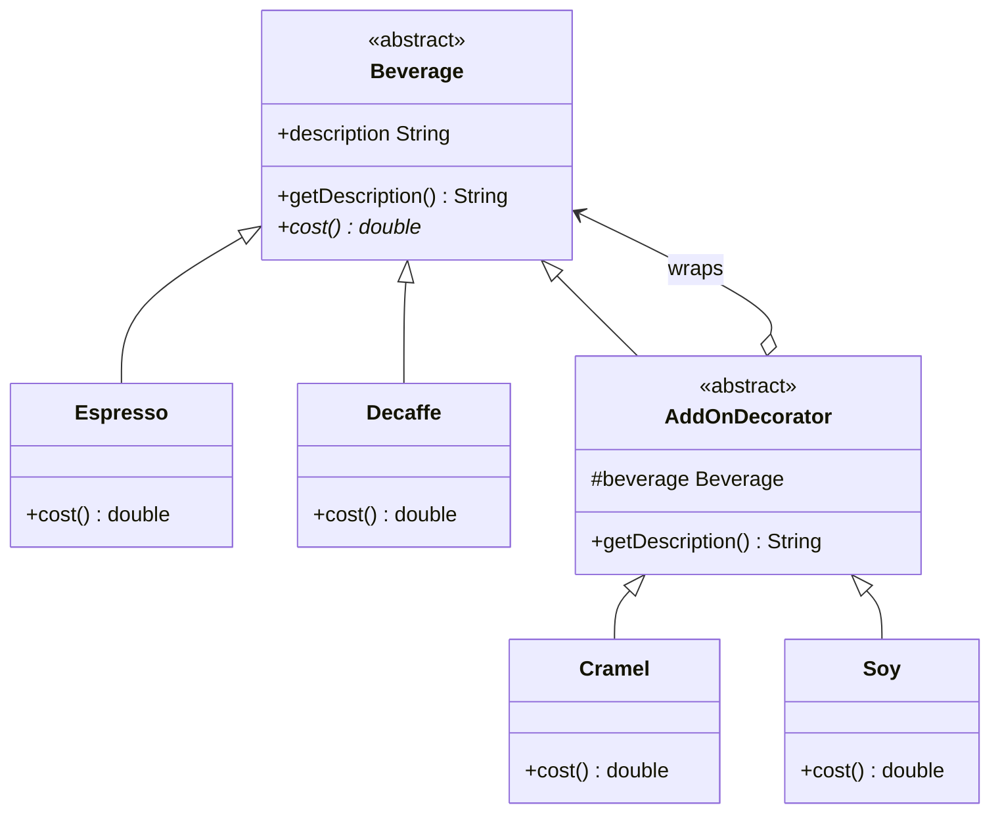

# Decorator Pattern

## What it is
Lets you attach new behavior to an individual object dynamically, by wrapping
it in another object that shares its interface, instead of subclassing every
possible combination of behavior up front.

## Class Diagram

## When to use it
- You need to add optional, combinable features to an object (add-ons,
  toppings, middleware, formatting layers) and subclassing would explode
  combinatorially (e.g. `EspressoWithSoyAndCaramel`, `EspressoWithSoy`, ...).
- You want to add/remove behavior at runtime, per instance, rather than at
  compile time for a whole class.
- Each decorator should be able to wrap another decorator, so you can stack
  any number of them in any order.

## How it's structured here
- [classes/beverage.dart](classes/beverage.dart) — the `Beverage` abstract
  class: `getDescription()` and `cost()`. Both the base drinks and the
  decorators implement this same interface, which is what makes wrapping
  transparent to the caller.
- [classes/espresso.dart](classes/espresso.dart),
  [classes/decaffe.dart](classes/decaffe.dart) — concrete base beverages with
  a fixed cost and description.
- [classes/add_on_decrator.dart](classes/add_on_decrator.dart) — the
  `AddOnDecorator` abstract class. It holds a reference to the wrapped
  `Beverage` and forwards to it, appending its own description.
- [classes/crammel.dart](classes/crammel.dart),
  [classes/soy.dart](classes/soy.dart) — concrete decorators. Each wraps a
  `Beverage`, adds its own cost on top of `beverage.cost()`, and appends its
  name to the description.
- [main.dart](main.dart) — wraps an `Espresso` in a `Cramel` decorator and
  prints both cost and description, showing the wrapped object still behaves
  like a `Beverage`.

## Key idea to remember
A decorator *is* a `Beverage` and *has* a `Beverage`. Because it implements
the same interface it wraps, decorators can be stacked arbitrarily —
`Soy(Cramel(Espresso()))` — and the caller never needs to know how many
layers deep it is.
