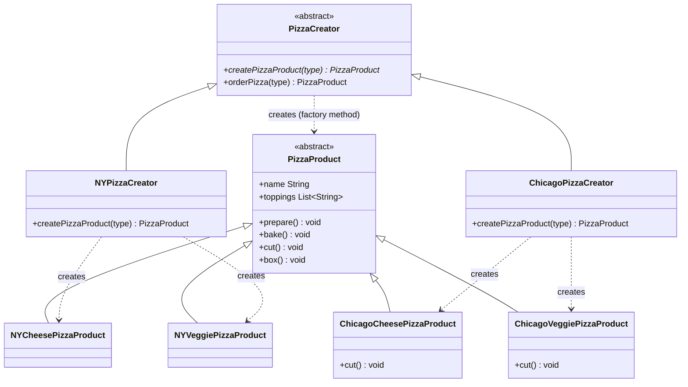

# Factory Method Pattern

## What it is
Defines a method for creating an object, but lets subclasses decide which
concrete class actually gets instantiated. The calling code depends only on
the abstract product type, never on a concrete constructor.

## Class Diagram

## When to use it
- A class can't know ahead of time which concrete subclass of a product it
  needs to create — that decision belongs to a subclass of the creator.
- You have shared logic (a recipe, a workflow) that stays the same, but one
  step of it — "make the thing" — needs to vary depending on context (region,
  platform, configuration).
- You want new product variants added by writing a new `ConcreteCreator` +
  `ConcreteProduct` pair, without editing existing creator code.

## How it's structured here
- [classes/pizza_product.dart](classes/pizza_product.dart) — the abstract
  `PizzaProduct`: the shared shape every pizza has (`prepare`, `bake`, `cut`,
  `box`).
- [classes/ny_cheese_pizza_product.dart](classes/ny_cheese_pizza_product.dart),
  [ny_veggie_pizza_product.dart](classes/ny_veggie_pizza_product.dart),
  [chicago_cheese_pizza_product.dart](classes/chicago_cheese_pizza_product.dart),
  [chicago_veggie_pizza_product.dart](classes/chicago_veggie_pizza_product.dart)
  — the `ConcreteProduct`s: region-specific pizzas with their own toppings
  (and Chicago pizzas even override `cut()`).
- [classes/pizza_creator.dart](classes/pizza_creator.dart) — the abstract
  `PizzaCreator`. Declares the factory method `createPizzaProduct(type)` and
  a template method `orderPizza(type)` that calls it — the ordering steps
  never change, only which pizza gets built.
- [classes/ny_pizza_creator.dart](classes/ny_pizza_creator.dart),
  [chicago_pizza_creator.dart](classes/chicago_pizza_creator.dart) — the
  `ConcreteCreator`s. Each implements `createPizzaProduct` to return its own
  region's pizzas.
- [main.dart](main.dart) — calls `orderPizza("cheese")` /
  `orderPizza("veggie")` on both an `NYPizzaCreator` and a
  `ChicagoPizzaCreator`, getting different concrete pizzas from identical
  calling code.

## Key idea to remember
Only *one* product family varies here — "which pizza" — and the decision is
made by subclassing the creator. Compare with [Abstract Factory](../5-abstract-factory/README.md),
where a whole *family* of related objects varies together.
