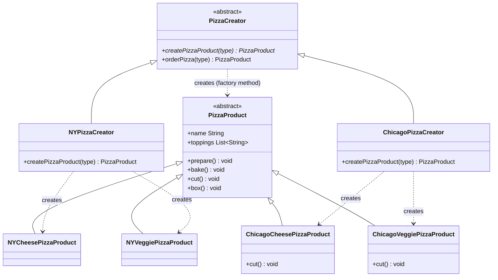

# 🍕 Factory Method Pattern

**Category:** Creational

> Defines an interface for creating an object, but lets subclasses decide
> which class to instantiate. Factory Method lets a class defer
> instantiation to subclasses.

## The Problem

A `PizzaStore` needs to create different pizzas depending on region — New
York style, Chicago style, and eventually more. The naive approach puts the
decision straight into the ordering logic with `new`:

```dart
class PizzaStore {
  Pizza orderPizza(String type, String region) {
    Pizza pizza;
    if (region == 'NY' && type == 'cheese') {
      pizza = NYCheesePizza();
    } else if (region == 'Chicago' && type == 'cheese') {
      pizza = ChicagoCheesePizza();
    } else if (region == 'NY' && type == 'veggie') {
      pizza = NYVeggiePizza();
    }
    // every new region or type means another branch here,
    // and orderPizza now directly depends on every concrete pizza class
    pizza.prepare();
    pizza.bake();
    pizza.cut();
    pizza.box();
    return pizza;
  }
}
```

This ties the shared ordering workflow (`prepare → bake → cut → box`) to
every concrete product via `new`, so `PizzaStore` must change every time a
new region or pizza type is introduced — even though the *steps of ordering*
never actually change.

**Real-world analogy:** a car manufacturer with plants in different
countries. Every plant follows the same overall assembly process, but the
"build the engine" step differs by plant — a US plant builds a US-spec
engine, a UK plant builds a UK-spec one. The shared assembly line doesn't
need to know engine details; it just calls "build the engine" and trusts the
local plant to supply the right one.

## How It Works

1. Define an abstract **Product** that all concrete products implement (here,
   `PizzaProduct`).
2. Define an abstract **Creator** with a **factory method** — an abstract
   method that returns a `Product` — and, usually, a **template method** that
   uses the factory method as one step of a larger, unchanging workflow.
3. Each **ConcreteCreator** subclass overrides the factory method to return
   its own `ConcreteProduct`.
4. Calling code only ever talks to the abstract `Creator` and `Product`
   types — it never calls a concrete constructor directly.
5. Adding a new product variant means adding one new `ConcreteCreator` +
   `ConcreteProduct` pair, with zero changes to existing code.

Mapped to this example: `PizzaCreator.orderPizza()` is the template method —
the ordering steps stay fixed — while `createPizzaProduct()` is the factory
method that `NYPizzaCreator` and `ChicagoPizzaCreator` each override
differently.

## Class Diagram



## Practical Examples

### Example 1: Simple illustrative example

A minimal notifier creator to see the shape of the pattern with nothing else
in the way.

```dart
// Product interface: every notification knows how to send itself.
abstract class Notification {
  void send(String message);
}

// ConcreteProduct: sends via email.
class EmailNotification implements Notification {
  @override
  void send(String message) => print('Email: $message');
}

// ConcreteProduct: sends via SMS.
class SmsNotification implements Notification {
  @override
  void send(String message) => print('SMS: $message');
}

// Creator: declares the factory method; calling code never uses `new` directly.
abstract class NotifierCreator {
  Notification createNotification();

  // Template-ish convenience method built on top of the factory method.
  void notify(String message) => createNotification().send(message);
}

// ConcreteCreator: produces email notifications.
class EmailNotifierCreator extends NotifierCreator {
  @override
  Notification createNotification() => EmailNotification();
}

// ConcreteCreator: produces SMS notifications.
class SmsNotifierCreator extends NotifierCreator {
  @override
  Notification createNotification() => SmsNotification();
}

void main() {
  final NotifierCreator emailNotifier = EmailNotifierCreator();
  final NotifierCreator smsNotifier = SmsNotifierCreator();

  emailNotifier.notify('Your order has shipped.');
  smsNotifier.notify('Your order has shipped.');
}
```

### Example 2: Realistic, production-like example

A document-export system where the workflow (build, watermark, save) is
fixed, but the concrete exporter (PDF vs. Word) varies by subclass — a
common shape for report-generation services.

```dart
// Product interface: every exported document can be saved to a path.
abstract class ExportedDocument {
  void save(String path);
}

// ConcreteProduct: a PDF document.
class PdfDocument implements ExportedDocument {
  @override
  void save(String path) => print('Saving PDF to $path.pdf');
}

// ConcreteProduct: a Word document.
class WordDocument implements ExportedDocument {
  @override
  void save(String path) => print('Saving Word doc to $path.docx');
}

// Creator: the factory method plus a template method (`exportReport`) that
// always runs the same steps, only the "create the document" step varies.
abstract class ReportExporter {
  ExportedDocument createDocument(); // the factory method

  void exportReport(String content, String outputPath) {
    final document = createDocument();
    print('Building report content...');
    print('Applying watermark to report...');
    document.save(outputPath);
  }
}

// ConcreteCreator: exports as PDF.
class PdfReportExporter extends ReportExporter {
  @override
  ExportedDocument createDocument() => PdfDocument();
}

// ConcreteCreator: exports as Word.
class WordReportExporter extends ReportExporter {
  @override
  ExportedDocument createDocument() => WordDocument();
}

void main() {
  final ReportExporter pdfExporter = PdfReportExporter();
  final ReportExporter wordExporter = WordReportExporter();

  pdfExporter.exportReport('Q3 sales figures', 'reports/q3-sales');
  wordExporter.exportReport('Q3 sales figures', 'reports/q3-sales');
}
```

## How It's Structured Here

- [classes/pizza_product.dart](classes/pizza_product.dart) — the abstract
  `PizzaProduct`: the shared shape every pizza has (`prepare`, `bake`, `cut`,
  `box`).
- [classes/ny_cheese_pizza_product.dart](classes/ny_cheese_pizza_product.dart),
  [ny_veggie_pizza_product.dart](classes/ny_veggie_pizza_product.dart),
  [chicago_cheese_pizza_product.dart](classes/chicago_cheese_pizza_product.dart),
  [chicago_veggie_pizza_product.dart](classes/chicago_veggie_pizza_product.dart)
  — the `ConcreteProduct`s: region-specific pizzas with their own toppings
  (and Chicago pizzas even override `cut()`).
- [classes/pizza_creator.dart](classes/pizza_creator.dart) — the abstract
  `PizzaCreator`. Declares the factory method `createPizzaProduct(type)` and
  a template method `orderPizza(type)` that calls it — the ordering steps
  never change, only which pizza gets built.
- [classes/ny_pizza_creator.dart](classes/ny_pizza_creator.dart),
  [chicago_pizza_creator.dart](classes/chicago_pizza_creator.dart) — the
  `ConcreteCreator`s. Each implements `createPizzaProduct` to return its own
  region's pizzas.
- [main.dart](main.dart) — calls `orderPizza("cheese")` /
  `orderPizza("veggie")` on both an `NYPizzaCreator` and a
  `ChicagoPizzaCreator`, getting different concrete pizzas from identical
  calling code.
- [xd.dart](xd.dart) — a small, standalone Abstract Factory example (UI
  widgets per OS theme), kept here as a scratch file for comparing the two
  patterns side by side. See [Abstract Factory](../5-abstract-factory/README.md)
  for the full write-up of that pattern.

## When to Use

- A class can't know ahead of time which concrete subclass of a product it
  needs to create — that decision belongs to a subclass of the creator.
- You have shared logic (a recipe, a workflow) that stays the same, but one
  step of it — "make the thing" — needs to vary depending on context (region,
  platform, configuration).
- You want new product variants added by writing a new `ConcreteCreator` +
  `ConcreteProduct` pair, without editing existing creator code — this keeps
  the Open/Closed Principle intact for the ordering workflow.

## When NOT to Use

- There's only ever going to be one product type — a plain constructor call
  is simpler and doesn't need a creator hierarchy at all.
- The "variation" is really just a constructor parameter (e.g. a size or
  color), not a different concrete class — a simple `if` or parameterized
  constructor is enough.
- You end up creating a creator subclass for every tiny product tweak — that
  produces a parallel class hierarchy that mirrors the product hierarchy
  one-to-one and becomes more boilerplate than the conditional it replaced.
- The whole *family* of related objects needs to change together, not just
  one product — that's a sign you actually need
  [Abstract Factory](../5-abstract-factory/README.md) instead.

## Related Patterns

| Pattern | Relationship |
|---|---|
| [Abstract Factory](../5-abstract-factory/README.md) | Often implemented *with* factory methods — but Abstract Factory varies a whole family of products together, Factory Method varies one. |
| Template Method | Factory Method is frequently one step inside a larger Template Method (like `orderPizza` here). |
| Prototype | Alternative — instead of subclassing a creator, Prototype creates new objects by cloning a pre-configured instance. |
| [Strategy](../1-strategy/README.md) | Complements Factory Method — a factory can decide *which* strategy object to construct and hand to a context. |

## Key Takeaway

Only *one* product varies here — "which pizza" — and the decision is pushed
down into a `ConcreteCreator` subclass instead of an `if/else` in
`PizzaStore`. This is the **Dependency Inversion Principle**: high-level
code (`orderPizza`) depends on the abstract `PizzaProduct`, and low-level
concrete pizzas depend on that same abstraction — neither depends on the
other directly. Compare with [Abstract Factory](../5-abstract-factory/README.md),
where a whole *family* of related objects varies together.
