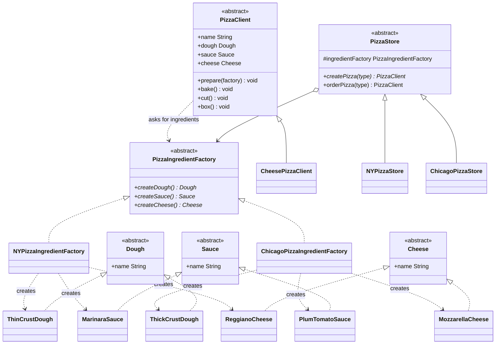

# Abstract Factory Pattern

## What it is
Provides an interface for creating *families* of related objects, without
specifying their concrete classes. Instead of one factory method for one
product, you get several creation methods on one factory, and swapping the
whole factory swaps every product in the family at once, consistently.

## Class Diagram

## When to use it
- A client needs several related objects that must be used together (e.g. a
  dough + sauce + cheese that all belong to the same regional style), and
  mixing objects from different families would be a bug.
- You want to guarantee that whichever factory the client is given, the
  objects it produces are always compatible with each other.
- You expect to add whole new families later (a new region, a new theme, a
  new platform) by adding one new factory, without touching the client code
  that consumes the family.

## How it's structured here
- [classes/dough.dart](classes/dough.dart),
  [classes/sauce.dart](classes/sauce.dart),
  [classes/cheese.dart](classes/cheese.dart) — the AbstractProducts (`Dough`,
  `Sauce`, `Cheese`) and their ConcreteProducts (`ThinCrustDough` /
  `ThickCrustDough`, `MarinaraSauce` / `PlumTomatoSauce`, `ReggianoCheese` /
  `MozzarellaCheese`).
- [classes/pizza_ingredient_factory.dart](classes/pizza_ingredient_factory.dart)
  — the AbstractFactory: `createDough()`, `createSauce()`, `createCheese()`.
- [classes/ny_pizza_ingredient_factory.dart](classes/ny_pizza_ingredient_factory.dart),
  [chicago_pizza_ingredient_factory.dart](classes/chicago_pizza_ingredient_factory.dart)
  — ConcreteFactories. Each one only ever returns ingredients from its own
  region, so the family stays consistent.
- [classes/pizza_client.dart](classes/pizza_client.dart),
  [classes/cheese_pizza_client.dart](classes/cheese_pizza_client.dart) — the
  Client. `PizzaClient.prepare()` takes *any* `PizzaIngredientFactory` and
  asks it for dough/sauce/cheese — it never hardcodes a region.
- [classes/pizza_store.dart](classes/pizza_store.dart),
  [ny_pizza_store.dart](classes/ny_pizza_store.dart),
  [chicago_pizza_store.dart](classes/chicago_pizza_store.dart) — wires a
  specific ingredient factory to a store so ordering a pizza automatically
  uses the right family of ingredients.
- [main.dart](main.dart) — orders a cheese pizza from `NYPizzaStore` and from
  `ChicagoPizzaStore`; same `CheesePizzaClient` code, different ingredient
  families injected underneath.

## Key idea to remember
The client code (`PizzaClient`) never picks an ingredient's concrete class —
it only calls methods on whatever `PizzaIngredientFactory` it was given. The
factory is what enforces that dough, sauce, and cheese all come from the same
family. Compare with [Factory Method](../4-factory-method/README.md), which
varies a single product instead of a whole family.
