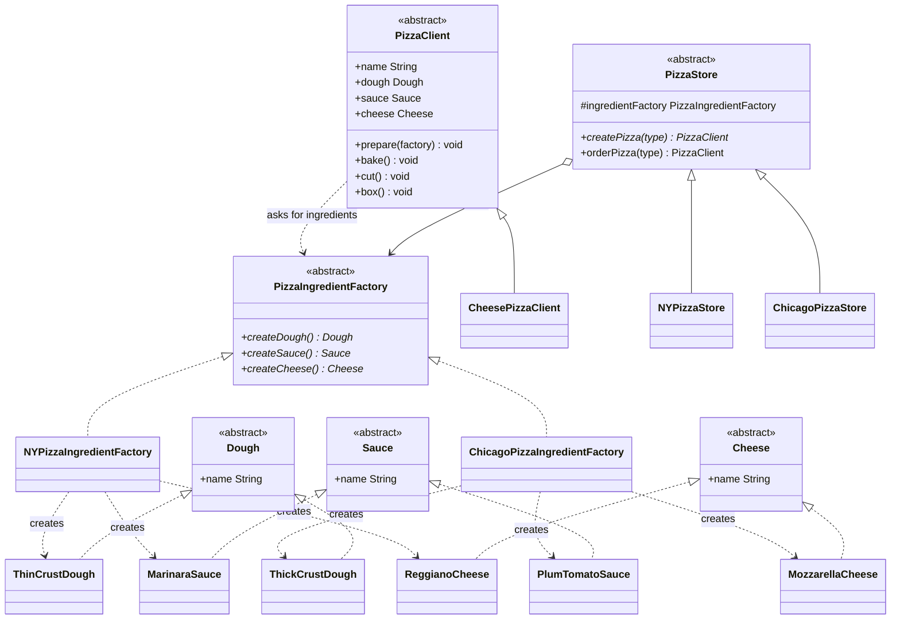

# 🏭 Abstract Factory Pattern

**Category:** Creational

> Provides an interface for creating families of related or dependent
> objects without specifying their concrete classes.

## The Problem

A `PizzaStore` needs dough, sauce, and cheese that all belong to the same
regional style — NY thin-crust dough must be paired with NY marinara sauce
and NY reggiano cheese, never mixed with Chicago ingredients. The naive
approach creates each ingredient separately with its own conditional:

```dart
Dough createDough(String region) =>
    region == 'NY' ? ThinCrustDough() : ThickCrustDough();

Sauce createSauce(String region) =>
    region == 'NY' ? MarinaraSauce() : PlumTomatoSauce();

Cheese createCheese(String region) =>
    region == 'NY' ? ReggianoCheese() : MozzarellaCheese();

// nothing stops a caller from mixing them up:
final badPizza = Pizza(createDough('NY'), createSauce('Chicago'), createCheese('NY'));
```

Nothing in this code *enforces* that the three ingredients stay consistent
with each other — it's just three independent conditionals a caller has to
remember to keep in sync by hand. As soon as a third region is added, every
one of these functions needs a new branch, and it's easy to accidentally mix
families.

**Real-world analogy:** furniture sets from a catalog. A "Modern" collection
gives you a modern sofa, modern chair, and modern coffee table; a "Victorian"
collection gives you the Victorian versions of the same three pieces. You
never pick the sofa from one collection and the chair from another — you
pick a *collection*, and it hands you a matching family of furniture.

## How It Works

1. Define an **AbstractProduct** interface for each kind of object in the
   family (here: `Dough`, `Sauce`, `Cheese`).
2. Implement **ConcreteProducts** for each family/variant (NY ingredients,
   Chicago ingredients).
3. Define an **AbstractFactory** interface with one creation method per
   product type (`createDough()`, `createSauce()`, `createCheese()`).
4. Implement one **ConcreteFactory** per family — each one only ever returns
   products from its own family, so consistency is guaranteed by
   construction, not by convention.
5. **Client** code is given *any* `AbstractFactory` and calls its creation
   methods without ever naming a concrete product class — swapping the whole
   family is just a matter of injecting a different factory.

Mapped to this example: `PizzaIngredientFactory` is the abstract factory.
`NYPizzaIngredientFactory` and `ChicagoPizzaIngredientFactory` each guarantee
their dough/sauce/cheese always match, and `PizzaClient.prepare()` works with
whichever factory it's handed, never hardcoding a region.

## Class Diagram



## Practical Examples

### Example 1: Simple illustrative example

A minimal UI-widget factory family (also mirrored in
[4-factory-method/xd.dart](../4-factory-method/xd.dart)) to see the shape of
the pattern with nothing else in the way.

```dart
// AbstractProducts: every theme must provide these two widget kinds.
abstract class Button {
  void render();
}

abstract class Checkbox {
  void render();
}

// ConcreteProducts: the "Light" family.
class LightButton implements Button {
  @override
  void render() => print('Rendering a light-themed button');
}

class LightCheckbox implements Checkbox {
  @override
  void render() => print('Rendering a light-themed checkbox');
}

// ConcreteProducts: the "Dark" family.
class DarkButton implements Button {
  @override
  void render() => print('Rendering a dark-themed button');
}

class DarkCheckbox implements Checkbox {
  @override
  void render() => print('Rendering a dark-themed checkbox');
}

// AbstractFactory: one creation method per product type in the family.
abstract class UiFactory {
  Button createButton();
  Checkbox createCheckbox();
}

// ConcreteFactory: only ever produces Light-family widgets.
class LightUiFactory implements UiFactory {
  @override
  Button createButton() => LightButton();
  @override
  Checkbox createCheckbox() => LightCheckbox();
}

// ConcreteFactory: only ever produces Dark-family widgets.
class DarkUiFactory implements UiFactory {
  @override
  Button createButton() => DarkButton();
  @override
  Checkbox createCheckbox() => DarkCheckbox();
}

// Client: works with any factory, never names a concrete widget class.
void renderScreen(UiFactory factory) {
  factory.createButton().render();
  factory.createCheckbox().render();
}

void main() {
  print('--- Light theme ---');
  renderScreen(LightUiFactory());

  print('--- Dark theme ---');
  renderScreen(DarkUiFactory());
}
```

### Example 2: Realistic, production-like example

A cross-database data-access layer where a repository must get a matching
family of connection, query builder, and transaction objects — mixing a
Postgres connection with a MySQL query builder would silently break at
runtime, so the factory guarantees they're always paired correctly.

```dart
// AbstractProducts: the family of objects a repository needs.
abstract class DbConnection {
  void connect();
}

abstract class QueryBuilder {
  String buildSelect(String table);
}

// ConcreteProducts: the Postgres family.
class PostgresConnection implements DbConnection {
  @override
  void connect() => print('Connecting to Postgres...');
}

class PostgresQueryBuilder implements QueryBuilder {
  @override
  String buildSelect(String table) => 'SELECT * FROM "$table";';
}

// ConcreteProducts: the MySQL family.
class MySqlConnection implements DbConnection {
  @override
  void connect() => print('Connecting to MySQL...');
}

class MySqlQueryBuilder implements QueryBuilder {
  @override
  String buildSelect(String table) => 'SELECT * FROM `$table`;';
}

// AbstractFactory: one creation method per product in the family.
abstract class DatabaseFactory {
  DbConnection createConnection();
  QueryBuilder createQueryBuilder();
}

// ConcreteFactory: guarantees Postgres connection + Postgres query builder.
class PostgresFactory implements DatabaseFactory {
  @override
  DbConnection createConnection() => PostgresConnection();
  @override
  QueryBuilder createQueryBuilder() => PostgresQueryBuilder();
}

// ConcreteFactory: guarantees MySQL connection + MySQL query builder.
class MySqlFactory implements DatabaseFactory {
  @override
  DbConnection createConnection() => MySqlConnection();
  @override
  QueryBuilder createQueryBuilder() => MySqlQueryBuilder();
}

// Client: a repository that works with any database family transparently.
class UserRepository {
  UserRepository(DatabaseFactory factory)
      : _connection = factory.createConnection(),
        _queryBuilder = factory.createQueryBuilder();

  final DbConnection _connection;
  final QueryBuilder _queryBuilder;

  void findAllUsers() {
    _connection.connect();
    print(_queryBuilder.buildSelect('users'));
  }
}

void main() {
  final postgresRepo = UserRepository(PostgresFactory());
  postgresRepo.findAllUsers();

  final mysqlRepo = UserRepository(MySqlFactory());
  mysqlRepo.findAllUsers();
}
```

## How It's Structured Here

- [classes/dough.dart](classes/dough.dart),
  [classes/sauce.dart](classes/sauce.dart),
  [classes/cheese.dart](classes/cheese.dart) — the AbstractProducts (`Dough`,
  `Sauce`, `Cheese`) and their ConcreteProducts (`ThinCrustDough` /
  `ThickCrustDough`, `MarinaraSauce` / `PlumTomatoSauce`, `ReggianoCheese` /
  `MozzarellaCheese`).
- [classes/pizza_ingredient_factory.dart](classes/pizza_ingredient_factory.dart)
  — the AbstractFactory: `createDough()`, `createSauce()`, `createCheese()`.
- [classes/ny_pizza_ingredient_factory.dart](classes/ny_pizza_ingredient_factory.dart),
  [chicago_pizza_ingredient_factory.dart](classes/chicago_pizza_ingredient_factory.dart)
  — ConcreteFactories. Each one only ever returns ingredients from its own
  region, so the family stays consistent.
- [classes/pizza_client.dart](classes/pizza_client.dart),
  [classes/cheese_pizza_client.dart](classes/cheese_pizza_client.dart) — the
  Client. `PizzaClient.prepare()` takes *any* `PizzaIngredientFactory` and
  asks it for dough/sauce/cheese — it never hardcodes a region.
- [classes/pizza_store.dart](classes/pizza_store.dart),
  [ny_pizza_store.dart](classes/ny_pizza_store.dart),
  [chicago_pizza_store.dart](classes/chicago_pizza_store.dart) — wires a
  specific ingredient factory to a store so ordering a pizza automatically
  uses the right family of ingredients.
- [main.dart](main.dart) — orders a cheese pizza from `NYPizzaStore` and from
  `ChicagoPizzaStore`; same `CheesePizzaClient` code, different ingredient
  families injected underneath.

## When to Use

- A client needs several related objects that must be used together (e.g. a
  dough + sauce + cheese that all belong to the same regional style), and
  mixing objects from different families would be a bug.
- You want to guarantee that whichever factory the client is given, the
  objects it produces are always compatible with each other — the
  compatibility rule lives in one place (the factory), not scattered across
  callers.
- You expect to add whole new families later (a new region, a new theme, a
  new platform) by adding one new factory, without touching the client code
  that consumes the family.

## When NOT to Use

- There's only one product, or the products in the "family" never actually
  need to vary together — this is a strong sign plain
  [Factory Method](../4-factory-method/README.md) is enough.
- The family of products is unlikely to ever grow — Abstract Factory's whole
  payoff is being able to add a new family without touching client code; if
  that never happens, the extra interface layer is unused ceremony.
- Adding a *new kind* of product to the family (a fourth ingredient, say)
  requires changing the AbstractFactory interface *and* every single
  ConcreteFactory — this is the pattern's known weak point, and worth
  weighing against how often new product types (vs. new families) get added.
- A single factory method with a switch would be just as clear — don't reach
  for a whole factory hierarchy to avoid one small, stable conditional.

## Related Patterns

| Pattern | Relationship |
|---|---|
| [Factory Method](../4-factory-method/README.md) | Often used to implement the creation methods inside an Abstract Factory; the key difference is family-of-products vs. single-product variation. |
| [Decorator](../3-decorator/README.md) | Can be combined — a factory can hand back a fully decorated product so the client never assembles the wrapper chain. |
| [Strategy](../1-strategy/README.md) | Complements Abstract Factory — a factory decides *which* family to build; a strategy can decide *how* one of those products behaves. |
| Singleton | Frequently paired — ConcreteFactories are often implemented as singletons, since there's usually no need for more than one instance per family. |

## Key Takeaway

The client code (`PizzaClient`) never picks an ingredient's concrete class —
it only calls methods on whatever `PizzaIngredientFactory` it was given, and
the factory is what enforces that dough, sauce, and cheese all come from the
same family. This is the principle **"depend upon abstractions, never
concretions"**: the client, the products, and the factories all communicate
through interfaces, so any family can be swapped in without touching the
others. Compare with [Factory Method](../4-factory-method/README.md), which
varies a single product instead of a whole family.
