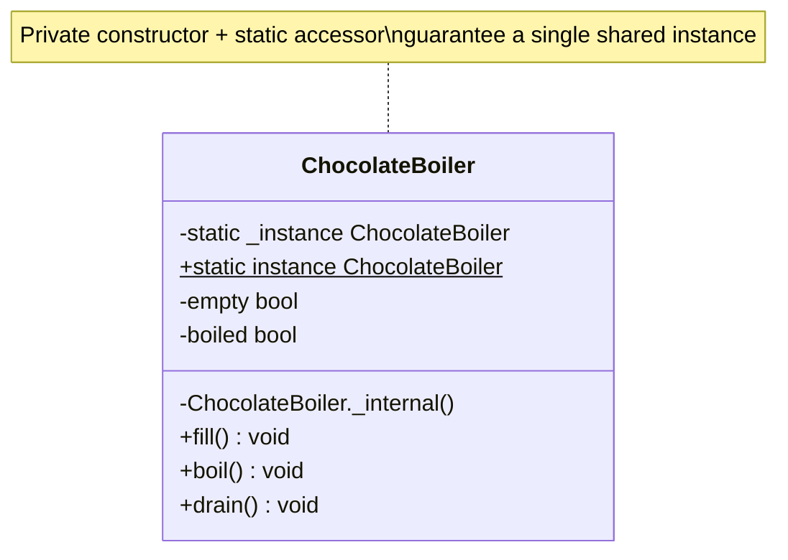

# 🍫 Singleton Pattern

**Category:** Creational

> Ensures a class has only one instance, and provides a global point of
> access to it.

## The Problem

A chocolate factory has exactly one `ChocolateBoiler` on the factory floor.
If two parts of the system each create their own instance, they stop
agreeing on the boiler's real-world state:

```dart
class ChocolateBoiler {
  ChocolateBoiler(); // public constructor — anyone can make one
  bool empty = true;
  bool boiled = false;
}

void main() {
  final boilerForFilling = ChocolateBoiler();
  boilerForFilling.empty = false; // "the boiler" now has milk in it...

  final boilerForBoiling = ChocolateBoiler();
  boilerForBoiling.boiled = true; // ...but this is a *different* boiler,
  // still empty, and now marked "boiled" while holding nothing at all.
}
```

Two objects now represent one physical boiler, and they silently disagree.
Worse, nothing stops a third, fourth, or hundredth instance from being
created elsewhere in the codebase — every new `ChocolateBoiler()` call is a
potential source of state that drifts out of sync with reality.

**Real-world analogy:** a company has exactly one CEO. Departments don't each
get to appoint their own CEO and expect company-wide decisions to stay
consistent — everyone who needs "the CEO" reaches out to the same person,
through the same one point of contact, no matter which department is asking.

## How It Works

1. Give the class a **private constructor** so no code outside the class can
   call `new` directly.
2. Store the one allowed instance in a **private static field** inside the
   class itself.
3. Expose a **public static accessor** (a getter or a static method) that
   returns that single instance — creating it on first access if it doesn't
   exist yet (lazy initialization), or up front (eager initialization).
4. Every caller, anywhere in the program, goes through that same accessor —
   so they're always guaranteed to be looking at the exact same object.

Dart specifics used here: `ChocolateBoiler._internal()` is a private named
constructor (the underscore makes it library-private, which is Dart's way of
blocking outside instantiation), and `static final ChocolateBoiler _instance`
creates the one instance eagerly and safely — Dart doesn't need the
double-checked locking dance the original Java example uses, because each
isolate runs single-threaded.

## Class Diagram



## Practical Examples

### Example 1: Simple illustrative example

A minimal, lazily-initialized `Logger` singleton to see the shape of the
pattern with nothing else in the way.

```dart
// The class controls its own instantiation via a private constructor.
class Logger {
  Logger._internal();

  static Logger? _instance;

  // Lazy: the instance is created on first access, not at class load time.
  static Logger get instance {
    _instance ??= Logger._internal();
    return _instance!;
  }

  void log(String message) => print('[LOG] $message');
}

void main() {
  Logger.instance.log('Application starting...');

  final logger = Logger.instance;
  logger.log('Reusing the exact same logger instance.');

  print('Same instance everywhere: ${identical(Logger.instance, logger)}');
}
```

### Example 2: Realistic, production-like example

An `AppConfig` singleton that loads configuration once and hands the same
parsed settings to every part of the app — a common real use case, since
re-reading and re-parsing a config file on every access would be wasteful
and could race with a config reload.

```dart
// A singleton that owns the one true copy of app configuration.
class AppConfig {
  AppConfig._internal(this.apiBaseUrl, this.maxRetries);

  static AppConfig? _instance;

  final String apiBaseUrl;
  final int maxRetries;

  // The instance is built once, from a "load" step, then reused everywhere.
  static AppConfig load({required String apiBaseUrl, required int maxRetries}) {
    if (_instance != null) {
      print('AppConfig already loaded — returning the existing instance.');
      return _instance!;
    }
    print('Loading configuration for the first time...');
    _instance = AppConfig._internal(apiBaseUrl, maxRetries);
    return _instance!;
  }

  static AppConfig get instance {
    if (_instance == null) {
      throw StateError('AppConfig.load() must be called before AppConfig.instance');
    }
    return _instance!;
  }
}

class ApiClient {
  void request(String path) {
    // Every ApiClient reads from the same, already-loaded config.
    print('Calling ${AppConfig.instance.apiBaseUrl}$path '
        '(max retries: ${AppConfig.instance.maxRetries})');
  }
}

void main() {
  AppConfig.load(apiBaseUrl: 'https://api.example.com', maxRetries: 3);
  AppConfig.load(apiBaseUrl: 'https://ignored.example.com', maxRetries: 99);

  ApiClient().request('/users');
  ApiClient().request('/orders');
}
```

## How It's Structured Here

- [classes/chocolate_boiler.dart](classes/chocolate_boiler.dart) — the
  `ChocolateBoiler` singleton. A private named constructor
  (`_internal()`) blocks outside instantiation, a private `static final`
  field holds the one instance, and `instance` is the public accessor every
  caller uses. `fill()`, `boil()`, and `drain()` mutate shared state that
  only makes sense if there's exactly one boiler.
- [main.dart](main.dart) — fetches `ChocolateBoiler.instance` through two
  different variables and shows with `identical()` that they point at the
  same object, then demonstrates that state changes made through one
  reference (`boiler1.fill()`) are visible through the other (`boiler2`).

## When to Use

- Exactly one instance of a class must coordinate actions across the whole
  system (a shared hardware resource, a connection pool, a configuration
  store) — because more than one would let parts of the program disagree
  about shared state.
- You need a well-known, global access point to that instance, but still
  want to control *how* and *when* it's created (e.g. lazily, on first use).
- The cost of creating the object is high and it can safely be reused for
  the lifetime of the app (a loaded config file, a cache, a logging sink).

## When NOT to Use

- As a substitute for passing dependencies explicitly — a Singleton is
  global mutable state by another name, and it makes code harder to test
  (you can't easily swap in a fake instance) and harder to reason about (any
  code, anywhere, can silently mutate it).
- When you might need more than one instance later (e.g. multiple database
  connections, multi-tenant configuration) — a Singleton bakes in "exactly
  one" as an assumption that's expensive to walk back.
- In multi-threaded environments without care — the classic Java
  double-checked-locking bugs around lazy singletons exist specifically
  because two threads can race to create the first instance; Dart sidesteps
  this within a single isolate, but the general pattern still needs care in
  isolate-based or multi-process designs.
- Just because it's convenient — reaching for a global accessor because
  passing a reference through a few constructors feels tedious is usually a
  sign the code's structure needs rethinking, not a singleton.

## Related Patterns

| Pattern | Relationship |
|---|---|
| [Abstract Factory](../5-abstract-factory/README.md) | ConcreteFactories are frequently implemented as singletons, since a family of products rarely needs more than one factory instance. |
| [Facade](../9-facade/README.md) | A facade is often implemented as a singleton, since there's usually no need for more than one entry point to a subsystem. |
| Builder | Different intent — Builder controls *how* a complex object is assembled; Singleton controls *how many* of an object can exist. |
| Monostate | Alternative — instead of one shared instance, every instance shares the same state (via static fields), so `new` still "works" but all objects behave identically. |

## Key Takeaway

Singleton controls instantiation itself — a private constructor plus a
static accessor guarantee that no matter how many times or where in the
codebase `instance` is requested, everyone gets the exact same object. Use it
deliberately and sparingly: it's one of the few patterns that introduces
global state on purpose, so the convenience of "access it from anywhere"
should always be weighed against the cost of losing the explicit
dependencies that make code easy to test and reason about.
