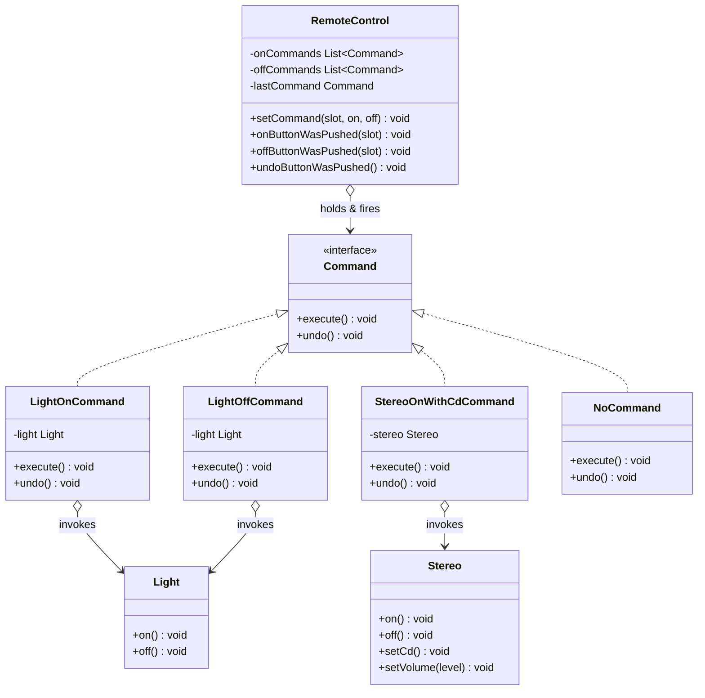

# 🎮 Command Pattern

**Category:** Behavioral

> Encapsulates a request as an object, thereby letting you parameterize
> other objects with different requests, queue or log requests, and support
> undoable operations.

## The Problem

A universal remote control has numbered slots, and each slot's On/Off
buttons need to do something completely different depending on what's
plugged in — turn on a light, start a stereo playing a CD, open a garage
door. The naive approach hard-codes every device into the remote itself:

```dart
class RemoteControl {
  void onButtonWasPushed(int slot) {
    if (slot == 0) {
      livingRoomLight.on();
    } else if (slot == 1) {
      stereo.on();
      stereo.setCd();
      stereo.setVolume(11);
    } else if (slot == 2) {
      garageDoor.up();
    }
    // every new device means editing RemoteControl again, and the remote
    // now depends directly on every device class it can ever control
  }
}
```

`RemoteControl` ends up knowing the concrete API of every appliance it might
ever control, and there's nowhere to plug in "undo" — the button-press logic
and the action it triggers are welded together in one method.

**Real-world analogy:** a restaurant order slip. A waiter doesn't walk to the
kitchen and cook your food themselves — they write your request on a slip
("Receiver: grill; Action: cook burger, medium") and hand it to the kitchen.
The waiter (invoker) doesn't need to know *how* to cook; the slip just needs
to be handed to whoever *can* carry it out (the receiver), whenever it's
convenient.

## How It Works

1. Define a **Command interface** with an `execute()` method (and often
   `undo()`).
2. Each **ConcreteCommand** wraps a **Receiver** — the object that actually
   knows how to do the work — and calls one or more methods on it inside
   `execute()`.
3. The **Invoker** (the remote control) holds commands, not receivers. It
   calls `execute()` on whatever command is in a given slot, without knowing
   what that command actually does.
4. Because a command is just an object, it can be stored, passed around,
   queued, logged, or — if it also implements `undo()` — reversed later by
   remembering the last command executed.
5. A **Null Object** command (`NoCommand`) can fill unassigned slots so the
   invoker never needs a null check before calling `execute()`.

Mapped to this example: `LightOnCommand` and `StereoOnWithCdCommand` are
ConcreteCommands wrapping the `Light` and `Stereo` receivers.
`RemoteControl` is the invoker — it just calls `execute()`/`undo()` on
whatever `Command` occupies a slot, whether that's one receiver call or
three bundled together.

## Class Diagram



## Practical Examples

### Example 1: Simple illustrative example

A minimal text-editor command stack to see the shape of the pattern with
nothing else in the way.

```dart
// Command interface: every editing action can execute and undo itself.
abstract class EditorCommand {
  void execute();
  void undo();
}

// Receiver: the object that actually holds and mutates the document text.
class TextDocument {
  String content = '';
}

// ConcreteCommand: appends text, and knows how to remove exactly what it added.
class AppendTextCommand implements EditorCommand {
  AppendTextCommand(this._document, this._text);
  final TextDocument _document;
  final String _text;

  @override
  void execute() => _document.content += _text;

  @override
  void undo() =>
      _document.content = _document.content.substring(0, _document.content.length - _text.length);
}

// Invoker: keeps a history so any executed command can be undone later.
class CommandHistory {
  final List<EditorCommand> _history = [];

  void execute(EditorCommand command) {
    command.execute();
    _history.add(command);
  }

  void undoLast() {
    if (_history.isEmpty) return;
    _history.removeLast().undo();
  }
}

void main() {
  final document = TextDocument();
  final history = CommandHistory();

  history.execute(AppendTextCommand(document, 'Hello'));
  history.execute(AppendTextCommand(document, ', World!'));
  print(document.content); // Hello, World!

  history.undoLast();
  print(document.content); // Hello
}
```

### Example 2: Realistic, production-like example

A task-queue worker where jobs are represented as command objects, so the
queue can accept, log, retry, and execute completely different job types
through one uniform interface — a common shape for background job systems.

```dart
// Command interface: every job knows how to run itself and describe itself.
abstract class Job {
  Future<void> run();
  String describe();
}

// ConcreteCommand: sends a welcome email (receiver logic simulated inline).
class SendWelcomeEmailJob implements Job {
  SendWelcomeEmailJob(this.userEmail);
  final String userEmail;

  @override
  Future<void> run() async {
    await Future.delayed(const Duration(milliseconds: 10));
    print('Sent welcome email to $userEmail');
  }

  @override
  String describe() => 'SendWelcomeEmailJob(to: $userEmail)';
}

// ConcreteCommand: regenerates a cached report.
class RegenerateReportJob implements Job {
  RegenerateReportJob(this.reportId);
  final String reportId;

  @override
  Future<void> run() async {
    await Future.delayed(const Duration(milliseconds: 10));
    print('Regenerated report $reportId');
  }

  @override
  String describe() => 'RegenerateReportJob(id: $reportId)';
}

// Invoker: a worker queue that runs any Job without knowing its concrete type.
class JobQueue {
  final List<Job> _pending = [];

  void enqueue(Job job) => _pending.add(job);

  Future<void> runAll() async {
    for (final job in _pending) {
      print('Running: ${job.describe()}');
      await job.run();
    }
    _pending.clear();
  }
}

void main() async {
  final queue = JobQueue();
  queue.enqueue(SendWelcomeEmailJob('new.user@example.com'));
  queue.enqueue(RegenerateReportJob('quarterly-sales'));

  await queue.runAll();
}
```

## How It's Structured Here

- [classes/command.dart](classes/command.dart) — the `Command` interface:
  `execute()` and `undo()`.
- [classes/light.dart](classes/light.dart),
  [classes/stereo.dart](classes/stereo.dart) — Receivers: the objects that
  actually know how to perform the work.
- [classes/light_on_command.dart](classes/light_on_command.dart),
  [classes/light_off_command.dart](classes/light_off_command.dart) —
  ConcreteCommands that bind a single `Light` call to `execute()`, and the
  opposite call to `undo()`.
- [classes/stereo_on_with_cd_command.dart](classes/stereo_on_with_cd_command.dart)
  — a ConcreteCommand showing that `execute()` can bundle several receiver
  calls into one logical action.
- [classes/no_command.dart](classes/no_command.dart) — the Null Object used
  to pre-fill every slot, so `RemoteControl` never needs a null check.
- [classes/remote_control.dart](classes/remote_control.dart) — the Invoker.
  Holds on/off commands per slot and remembers the last command executed so
  `undoButtonWasPushed()` can reverse it, all without knowing what any
  command actually does.
- [main.dart](main.dart) — wires a light into slot 0 and a stereo into
  slot 1, then demonstrates on/off/undo for a single-call command and undo
  for a bundled, multi-call command.

## When to Use

- You need to decouple the object that *invokes* an operation from the
  object that *knows how to perform* it (menus, buttons, remote controls,
  API endpoints calling into business logic).
- You want undo/redo support — because each command already knows both how
  to do its action and how to reverse it, an invoker just has to remember
  the last (or a stack of) commands.
- You want to queue, log, or schedule operations for later — since a command
  is just an object, it can be stored, serialized, retried, or replayed.
- You want to support macro commands — bundling several commands into one
  composite command that executes (and undoes) them all together.

## When NOT to Use

- The action is a single, simple method call with no need for undo,
  queuing, or logging — wrapping it in a full command object is unnecessary
  indirection for something a direct call already does clearly.
- Undo logic is significantly harder to implement correctly than the action
  itself (e.g. actions with side effects on external systems) — a command
  that *can't* really be undone but claims to have `undo()` is worse than no
  undo support at all.
- You need every command's `undo()` to compose correctly across a long
  history — this requires careful state capture per command, and it's easy
  to end up with commands that "undo" into a slightly wrong state if that
  discipline slips.

## Related Patterns

| Pattern | Relationship |
|---|---|
| [Strategy](../1-strategy/README.md) | Structurally similar (an interface + interchangeable implementations), but Command represents a request/action, while Strategy represents an algorithm. |
| Memento | Complements Command — Memento can capture an object's state so a command's `undo()` has something concrete to restore. |
| Composite | Used together for macro commands — a `MacroCommand` holds a list of commands and calls `execute()`/`undo()` on all of them. |
| [Observer](../2-observer/README.md) | Can be combined — executing a command can trigger notifications to observers about what just happened. |

## Key Takeaway

Command turns "do this action" into an object, which decouples the invoker
(the remote, the menu, the queue) from the receiver (the light, the stereo,
the report generator) — the invoker only ever needs to know about the
`Command` interface. This is **"encapsulate what varies"** applied to
behavior itself: the *request* becomes the thing you can store, pass around,
queue, and reverse, instead of being locked into the exact moment and method
call where it originated.
