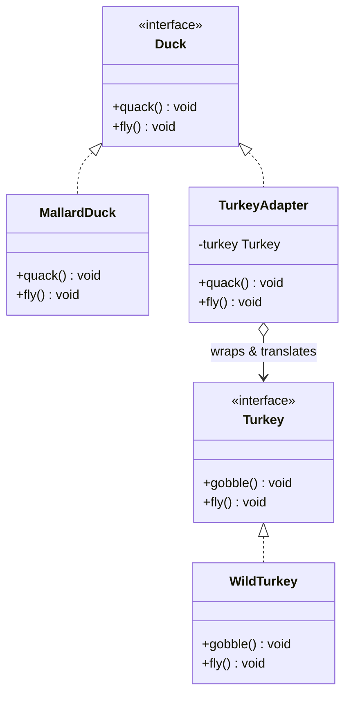

# 🔌 Adapter Pattern

**Category:** Structural

> Converts the interface of a class into another interface clients expect.
> Adapter lets classes work together that couldn't otherwise because of
> incompatible interfaces.

## The Problem

Code that works with `Duck` objects (calling `quack()` and `fly()`) suddenly
needs to also work with `Turkey` objects from a different part of the
codebase — but turkeys expose `gobble()` and `fly()`, not `quack()`. The
naive fix is to special-case the turkey everywhere it's used:

```dart
void testBird(Object bird) {
  if (bird is Duck) {
    bird.quack();
    bird.fly();
  } else if (bird is Turkey) {
    bird.gobble(); // different method name for "the same idea"
    bird.fly();
  }
  // every place that uses birds needs this same type-check,
  // and adding a third bird type means updating all of them
}
```

Every caller that wants to treat ducks and turkeys uniformly has to know
about both concrete types and their different method names. The
incompatibility between `Duck` and `Turkey` leaks into every piece of code
that touches both.

**Real-world analogy:** a travel power adapter. Your laptop charger has a US
plug; the wall socket in another country only accepts a different shape.
You don't rewire the charger or the wall — you plug a small adapter in
between that presents the shape the wall expects on one side, and passes the
electricity through to your charger's shape on the other.

## How It Works

1. Identify the **Target** interface that client code already expects (here,
   `Duck`).
2. Identify the **Adaptee** — the existing class with the interface you
   actually have (`Turkey`), which you can't or don't want to change.
3. Create an **Adapter** class that implements the Target interface and
   holds a reference to an Adaptee instance.
4. Inside each Target method, the Adapter translates the call into one or
   more calls on the Adaptee, converting parameters, return values, or even
   the number of calls as needed.
5. Client code only ever talks to the Target interface — it can use a real
   `Duck` or a `TurkeyAdapter` completely interchangeably.

Mapped to this example: `TurkeyAdapter` implements `Duck`. Its `quack()`
forwards to `_turkey.gobble()`, and because a turkey only flies short
distances per call, `fly()` calls the turkey's `fly()` five times to
approximate one duck-length flight — the *translation* is exactly the
adapter's job.

## Class Diagram



## Practical Examples

### Example 1: Simple illustrative example

Adapting an old temperature sensor (Fahrenheit-only) to a modern interface
that expects Celsius, without modifying the sensor itself.

```dart
// Target: the interface modern client code expects.
abstract class CelsiusSensor {
  double readCelsius();
}

// Adaptee: a legacy sensor with an incompatible interface (and unit).
class LegacyFahrenheitSensor {
  double readFahrenheit() => 98.6;
}

// Adapter: implements the Target, converting the Adaptee's data on the way through.
class FahrenheitToCelsiusAdapter implements CelsiusSensor {
  FahrenheitToCelsiusAdapter(this._legacySensor);
  final LegacyFahrenheitSensor _legacySensor;

  @override
  double readCelsius() => (_legacySensor.readFahrenheit() - 32) * 5 / 9;
}

void main() {
  final CelsiusSensor sensor = FahrenheitToCelsiusAdapter(LegacyFahrenheitSensor());
  print('Temperature: ${sensor.readCelsius().toStringAsFixed(1)}°C');
}
```

### Example 2: Realistic, production-like example

An app's payment flow is written against its own `PaymentGateway`
interface, but needs to integrate a third-party SDK whose API shape is
completely different — a very common real-world use of Adapter when
wiring in an external library.

```dart
// Target: the interface the rest of the app is written against.
abstract class PaymentGateway {
  Future<bool> charge({required double amountUsd, required String cardToken});
}

// Adaptee: a third-party SDK client with its own conventions (imagine this
// class ships from an external package and can't be modified).
class ThirdPartyPaymentSdk {
  Future<Map<String, dynamic>> createCharge({
    required int amountCents,
    required String token,
    required String currency,
  }) async {
    print('ThirdPartyPaymentSdk: charging $amountCents cents ($currency) to $token');
    return {'status': 'succeeded'};
  }
}

// Adapter: implements the app's PaymentGateway, translating units and shape.
class ThirdPartyPaymentAdapter implements PaymentGateway {
  ThirdPartyPaymentAdapter(this._sdk);
  final ThirdPartyPaymentSdk _sdk;

  @override
  Future<bool> charge({required double amountUsd, required String cardToken}) async {
    final result = await _sdk.createCharge(
      amountCents: (amountUsd * 100).round(),
      token: cardToken,
      currency: 'usd',
    );
    return result['status'] == 'succeeded';
  }
}

// Client code: only ever depends on PaymentGateway, never on the SDK directly.
class CheckoutService {
  CheckoutService(this._gateway);
  final PaymentGateway _gateway;

  Future<void> completePurchase(double amount, String cardToken) async {
    final success = await _gateway.charge(amountUsd: amount, cardToken: cardToken);
    print(success ? 'Payment succeeded' : 'Payment failed');
  }
}

void main() async {
  final gateway = ThirdPartyPaymentAdapter(ThirdPartyPaymentSdk());
  final checkout = CheckoutService(gateway);

  await checkout.completePurchase(49.99, 'tok_visa');
}
```

## How It's Structured Here

- [classes/duck.dart](classes/duck.dart) — the `Duck` interface: the Target
  that client code (`testDuck`) is written against.
- [classes/mallard_duck.dart](classes/mallard_duck.dart) — `MallardDuck`, a
  native implementation of the Target, used to show what "real" `Duck`
  behavior looks like.
- [classes/turkey.dart](classes/turkey.dart) — the `Turkey` interface (the
  Adaptee) and `WildTurkey`, a concrete turkey with its own, incompatible API.
- [classes/turkey_adapter.dart](classes/turkey_adapter.dart) —
  `TurkeyAdapter`. Implements `Duck`, wraps a `Turkey`, and translates
  `quack()`/`fly()` calls into `gobble()`/repeated `fly()` calls.
- [main.dart](main.dart) — runs the same `testDuck()` function against a
  real `MallardDuck` and against a `TurkeyAdapter` wrapping a `WildTurkey`,
  showing the adapted turkey is indistinguishable from a real duck to the
  calling code.

## When to Use

- You want to use an existing class, but its interface doesn't match what
  the rest of your code expects — and you can't (or shouldn't) modify that
  class, especially if it's third-party or legacy code.
- You're integrating multiple components or libraries that were designed
  independently and have incompatible interfaces for conceptually similar
  things.
- You want to introduce a stable interface in your own code while being free
  to swap the underlying implementation (and its adapter) later without
  touching client code.

## When NOT to Use

- You control both interfaces and they can simply be unified — if you can
  change the Adaptee's interface directly, that's usually simpler than
  wrapping it forever.
- Only one or two call sites need the translation — an inline conversion at
  the call site may be clearer than standing up a whole adapter class for
  something used in exactly one place.
- The two interfaces differ so fundamentally that the adapter has to fake or
  approximate behavior the Target promises but the Adaptee can't actually
  provide — that's a sign the abstraction itself is a poor fit, not just the
  interface shape.
- Every adaptation adds a layer of indirection; stacking many adapters (an
  adapter of an adapter of an adapter) makes the real call chain hard to
  trace and debug.

## Related Patterns

| Pattern | Relationship |
|---|---|
| [Decorator](../3-decorator/README.md) | Different intent — Decorator keeps the same interface and adds behavior; Adapter changes the interface to match what's expected. |
| [Facade](../9-facade/README.md) | Related but distinct — Facade simplifies access to a whole subsystem with a new, simpler interface; Adapter matches one existing interface to another, one-to-one. |
| [Proxy](../10-proxy/README.md) | Structurally similar (both wrap another object behind a shared interface), but Proxy keeps the *same* interface and controls access, rather than translating between two different ones. |
| Bridge | Related structurally, but Bridge is a proactive design decision made up front to separate abstraction from implementation, not a reactive fix for incompatible interfaces after the fact. |

## Key Takeaway

An adapter lets old (or foreign) code work with new code by translating one
interface into another, without modifying either side. This embodies the
principle of **programming to an interface, not an implementation**: client
code depends only on `Duck`, so it doesn't matter — and doesn't need to
know — whether a `Duck` in hand is a real `MallardDuck` or a `Turkey`
wearing an adapter.
