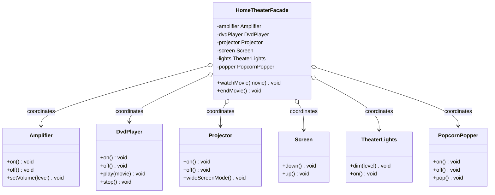

# 🎬 Facade Pattern

**Category:** Structural

> Provides a unified interface to a set of interfaces in a subsystem.
> Facade defines a higher-level interface that makes the subsystem easier
> to use.

## The Problem

A home theater has an amplifier, a DVD player, a projector, a screen, dimmed
lights, and a popcorn popper — and "watch a movie" means operating all six
of them, in the right order, every single time:

```dart
void main() {
  popper.on();
  popper.pop();
  lights.dim(10);
  screen.down();
  projector.on();
  projector.wideScreenMode();
  amplifier.on();
  amplifier.setVolume(5);
  dvdPlayer.on();
  dvdPlayer.play('The Matrix');
  // every caller who wants to watch a movie has to know and repeat
  // this exact 10-step sequence, in the exact right order
}
```

Every place that wants to "watch a movie" has to duplicate this exact
sequence, know every subsystem's API, and get the order right. If the
projector's API changes, or a new device is added to the setup, every one of
those call sites needs to be found and updated.

**Real-world analogy:** a hotel concierge desk. You don't personally call the
restaurant to book a table, ring the spa to schedule a massage, and phone
the box office for theater tickets — you tell the concierge what you want
("a nice evening out"), and they coordinate every subsystem behind the
scenes through one simple conversation.

## How It Works

1. Identify a **subsystem** made of several classes with their own detailed,
   often interdependent APIs (`Amplifier`, `DvdPlayer`, `Projector`,
   `Screen`, `TheaterLights`, `PopcornPopper`).
2. Create a **Facade** class that holds references to the subsystem
   components.
3. Give the Facade a small number of high-level methods (`watchMovie()`,
   `endMovie()`) that internally call the right subsystem methods, in the
   right order, on the caller's behalf.
4. Client code depends only on the Facade for the common case — the
   subsystem classes are still there and still fully usable directly for
   anyone who needs finer control, but nobody is *forced* to know them.
5. The Facade doesn't add new capability — it doesn't hide the subsystem
   permanently — it just removes the *need* to know the subsystem's details
   for the common, everyday operations.

Mapped to this example: `HomeTheaterFacade.watchMovie()` sequences popcorn,
lights, screen, projector, amplifier, and DVD player into one call; the
caller in `main.dart` never touches any of those six classes directly.

## Class Diagram



## Practical Examples

### Example 1: Simple illustrative example

A minimal computer "boot up" facade over CPU, memory, and hard-drive
subsystems to see the shape of the pattern with nothing else in the way.

```dart
// Subsystem classes, each with their own detailed API.
class Cpu {
  void freeze() => print('CPU: freeze');
  void jump(int position) => print('CPU: jump to $position');
  void execute() => print('CPU: execute');
}

class Memory {
  void load(int position, String data) => print('Memory: load "$data" at $position');
}

class HardDrive {
  String read(int lba, int size) => 'boot-sector-data';
}

// Facade: one method that hides the multi-step, order-sensitive startup sequence.
class ComputerFacade {
  ComputerFacade(this._cpu, this._memory, this._hardDrive);
  final Cpu _cpu;
  final Memory _memory;
  final HardDrive _hardDrive;

  void start() {
    _cpu.freeze();
    final bootData = _hardDrive.read(0, 1024);
    _memory.load(0, bootData);
    _cpu.jump(0);
    _cpu.execute();
  }
}

void main() {
  final computer = ComputerFacade(Cpu(), Memory(), HardDrive());
  computer.start(); // one call instead of four, in the right order
}
```

### Example 2: Realistic, production-like example

An `OrderFacade` over inventory, payment, and shipping subsystems — a
common real-world shape where placing an order means coordinating several
independent services, but callers just want "place the order."

```dart
// Subsystem: checks and reserves stock.
class InventoryService {
  bool reserve(String sku, int quantity) {
    print('Inventory: reserved $quantity x $sku');
    return true;
  }
}

// Subsystem: charges the customer.
class PaymentService {
  bool charge(String cardToken, double amount) {
    print('Payment: charged \$$amount to $cardToken');
    return true;
  }
}

// Subsystem: schedules a shipment.
class ShippingService {
  String schedule(String address) {
    print('Shipping: scheduled delivery to $address');
    return 'TRACK-12345';
  }
}

// Subsystem: sends confirmation email.
class NotificationService {
  void sendOrderConfirmation(String email, String trackingId) {
    print('Notification: confirmation sent to $email (tracking: $trackingId)');
  }
}

// Facade: coordinates all four subsystems behind one high-level operation.
class OrderFacade {
  OrderFacade({
    required InventoryService inventory,
    required PaymentService payment,
    required ShippingService shipping,
    required NotificationService notifications,
  })  : _inventory = inventory,
        _payment = payment,
        _shipping = shipping,
        _notifications = notifications;

  final InventoryService _inventory;
  final PaymentService _payment;
  final ShippingService _shipping;
  final NotificationService _notifications;

  bool placeOrder({
    required String sku,
    required int quantity,
    required String cardToken,
    required double amount,
    required String address,
    required String email,
  }) {
    if (!_inventory.reserve(sku, quantity)) return false;
    if (!_payment.charge(cardToken, amount)) return false;
    final trackingId = _shipping.schedule(address);
    _notifications.sendOrderConfirmation(email, trackingId);
    return true;
  }
}

void main() {
  final orderFacade = OrderFacade(
    inventory: InventoryService(),
    payment: PaymentService(),
    shipping: ShippingService(),
    notifications: NotificationService(),
  );

  orderFacade.placeOrder(
    sku: 'DESIGN-PATTERNS-BOOK',
    quantity: 1,
    cardToken: 'tok_visa',
    amount: 39.99,
    address: '123 Main St',
    email: 'reader@example.com',
  );
}
```

## How It's Structured Here

- [classes/amplifier.dart](classes/amplifier.dart),
  [classes/dvd_player.dart](classes/dvd_player.dart),
  [classes/projector.dart](classes/projector.dart),
  [classes/screen.dart](classes/screen.dart),
  [classes/theater_lights.dart](classes/theater_lights.dart),
  [classes/popcorn_popper.dart](classes/popcorn_popper.dart) — the
  subsystem. Six independent classes, each with its own small API and no
  knowledge of each other.
- [classes/home_theater_facade.dart](classes/home_theater_facade.dart) —
  `HomeTheaterFacade`. Holds a reference to each subsystem component and
  exposes exactly two high-level methods, `watchMovie()` and `endMovie()`,
  that sequence the right calls on the right devices.
- [main.dart](main.dart) — builds all six subsystem objects, wires them into
  one `HomeTheaterFacade`, then calls `watchMovie()` and `endMovie()` —
  never touching a subsystem class directly.

## When to Use

- A subsystem has many classes with a complex, order-sensitive API, but most
  callers only need a handful of common operations — the facade captures
  that common path in one place instead of every caller re-deriving it.
- You want to decouple client code from a subsystem's internals, so the
  subsystem can be refactored or replaced later without breaking every
  caller — only the facade needs to change.
- You're introducing a third-party library or legacy subsystem into your app
  and want to expose only the parts your app actually needs, through an
  interface that matches your app's vocabulary.
- You want to layer your architecture — a facade per subsystem is a natural
  boundary between "high-level application code" and "low-level subsystem
  details."

## When NOT to Use

- The subsystem is already simple (one or two classes with a small API) — a
  facade over something that's already easy to use just adds an indirection
  with no real simplification.
- Some callers genuinely need fine-grained control over individual
  subsystem components — a facade shouldn't become the *only* way in; keep
  the subsystem classes accessible directly for those cases (this example's
  facade doesn't prevent calling `Amplifier` directly if needed).
- The facade starts accumulating unrelated responsibilities beyond
  "simplify this subsystem" — that's a sign it's turning into a god object
  rather than a clean entry point.
- You need to swap out arbitrary parts of the subsystem's behavior — a
  facade with fixed, hard-coded sequencing isn't the right tool for
  configurable pipelines; consider [Strategy](../1-strategy/README.md) or
  [Command](../7-command/README.md) for that instead.

## Related Patterns

| Pattern | Relationship |
|---|---|
| [Adapter](../8-adapter/README.md) | Different intent — Adapter matches one existing interface to another it's expected to satisfy; Facade defines a brand-new, simpler interface over many classes. |
| [Singleton](../6-singleton/README.md) | Often paired — a facade is usually implemented as a singleton, since there's rarely a need for more than one entry point into a subsystem. |
| Mediator | Related — both centralize communication, but Mediator coordinates peer objects that talk *to each other*, while Facade simplifies access *into* a subsystem from the outside. |
| [Abstract Factory](../5-abstract-factory/README.md) | Complements Facade — a factory can be used to supply the facade with the correct family of subsystem objects to wrap. |

## Key Takeaway

A facade doesn't hide a subsystem's power — it just gives most callers a
simpler front door that covers the common cases, while the subsystem stays
fully accessible for anyone who needs more control. This follows the
**Principle of Least Knowledge** (the Law of Demeter): client code that
just wants to watch a movie should only need to know about
`HomeTheaterFacade`, not the six devices and the order they need to be
turned on in.
